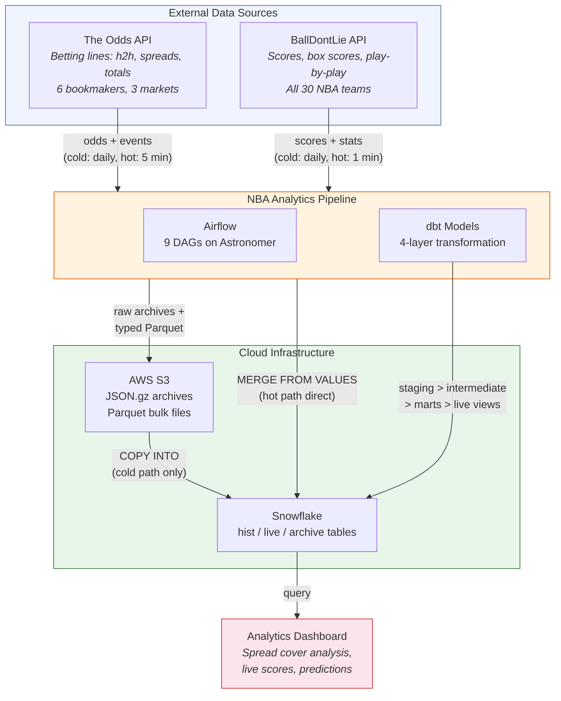
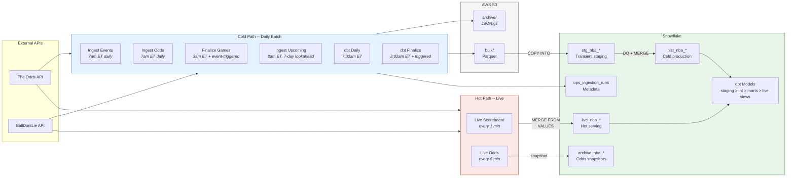
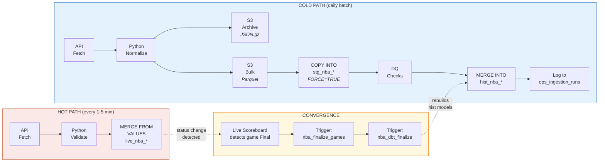
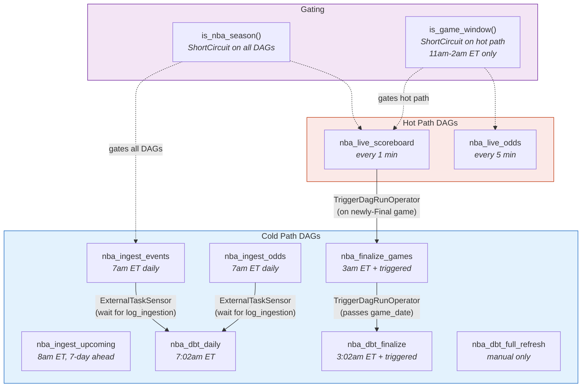

# Architecture: NBA Spread-Beating Analytics Pipeline

An end-to-end data platform that ingests NBA betting odds and game results, transforms them through a hot/cold dual-path architecture, and serves spread cover analysis via dbt-powered analytics models.

**Stack:** Apache Airflow (Astronomer) | dbt (Cosmos) | Snowflake | AWS S3 | Python | PyArrow

**Scale:** 2 external APIs | 9 orchestrated DAGs | 30+ dbt models | 1-minute live refresh | Full 2023-present backfill

---

## System Context

How the pipeline interacts with external systems and users.



---

## Container Architecture

The internal structure of the pipeline, showing how cold and hot paths share infrastructure.



---

## Hot / Cold Path Data Flow

The cold path prioritizes durability and data quality; the hot path prioritizes speed. They converge when a live game goes Final.



**Why two paths?** The cold path writes to S3 (replay capability), stages data (DQ validation), and MERGEs atomically into production -- true idempotency with full audit trail. The hot path skips S3 and staging entirely, going straight from API to `MERGE FROM VALUES` for sub-minute latency. The cold path runs as a safety net at 3am ET, catching anything the hot path missed.

---

## dbt Model Lineage

Four-layer transformation from raw Snowflake tables to dashboard-ready analytics, using the WAP (Write-Audit-Publish) pattern for incremental models.

```mermaid
flowchart TD
    subgraph sources["Sources (Snowflake Tables)"]
        direction LR
        S_EV["hist_nba_events"]
        S_OD["hist_nba_odds_open"]
        S_GM["hist_nba_games"]
        S_BX["hist_nba_player_box_scores"]
        S_TM["hist_nba_teams"]
    end

    subgraph staging["Staging Layer (views)"]
        direction LR
        STG_EV["stg_nba__events\n<i>rename, coalesce</i>"]
        STG_OD["stg_nba__odds_open\n<i>implied prob, dedup</i>"]
        STG_GM["stg_nba__games\n<i>margin, total pts</i>"]
        STG_BX["stg_nba__player_box_scores\n<i>parse minutes, season fix</i>"]
        STG_TM["stg_nba__teams\n<i>rename</i>"]
    end

    subgraph intermediate["Intermediate Layer (incremental, WAP)"]
        direction LR
        INT_TGS["int_nba__team_game_stats\n<i>player -> team agg\nFour Factors, ratings</i>"]
        INT_CL["int_nba__consensus_lines\n<i>median across books</i>"]
        INT_GBR["int_nba__game_betting_results\n<i>cover/push logic</i>"]
        INT_TRS["int_nba__team_rolling_stats\n<i>L10 + season avgs</i>"]
        INT_PRS["int_nba__player_rolling_stats\n<i>Hollinger Game Score\nL10 + season avgs</i>"]
    end

    subgraph marts["Marts Layer (tables / incremental)"]
        direction LR
        M_GR["mart_nba__game_results\n<i>wide-format per game</i>"]
        M_ATS["mart_nba__team_ats_records\n<i>ATS win/loss/push</i>"]
        M_MS["mart_nba__team_matchup_stats\n<i>season averages, ranks</i>"]
        M_GG["mart_nba__game_grades\n<i>performance vs baseline</i>"]
        M_GP["mart_nba__game_predictions\n<i>cover prob, EV, star rating</i>"]
        M_PG["mart_nba__player_game_grades\n<i>player perf grades</i>"]
    end

    subgraph live["Live Layer (views over hot-path tables)"]
        direction LR
        L_SB["live_nba__scoreboard"]
        L_PBX["live_nba__player_box_scores"]
        L_TBX["live_nba__team_box_scores"]
        L_PL["live_nba__plays"]
        L_OC["live_nba__odds_current\n<i>+ consensus</i>"]
        L_OM["live_nba__odds_movement"]
        L_GD["live_nba__game_detail"]
        L_GG["live_nba__game_grades"]
    end

    S_EV --> STG_EV
    S_OD --> STG_OD
    S_GM --> STG_GM
    S_BX --> STG_BX
    S_TM --> STG_TM

    STG_BX --> INT_TGS
    STG_GM --> INT_TGS
    STG_OD --> INT_CL
    STG_GM --> INT_GBR
    STG_EV --> INT_GBR
    INT_CL --> INT_GBR
    INT_TGS --> INT_TRS
    STG_BX --> INT_PRS

    INT_GBR --> M_GR
    STG_GM --> M_GR
    INT_GBR --> M_ATS
    STG_GM --> M_ATS
    INT_TRS --> M_MS
    STG_TM --> M_MS
    INT_TRS --> M_GG
    M_GR --> M_GG
    STG_EV --> M_GP
    INT_CL --> M_GP
    INT_TRS --> M_GP
    M_ATS --> M_GP
    INT_PRS --> M_PG
    M_GR --> M_PG

    INT_TRS -.->|"cross-path join\n(cold baselines)"| L_GG
    INT_PRS -.->|"cross-path join"| L_GG

    style sources fill:#f5f5f5,stroke:#616161
    style staging fill:#e8f5e9,stroke:#2e7d32
    style intermediate fill:#fff3e0,stroke:#e65100
    style marts fill:#e3f2fd,stroke:#1565c0
    style live fill:#fbe9e7,stroke:#bf360c
```



**WAP pattern:** Each incremental model has a paired `audit_*` table that materializes only the current batch. dbt tests validate the audit table (the "audit" step), then the production incremental model reads from it (the "publish" step). This ensures no bad data reaches production models.

**Cross-path dependency:** Live game grades (`live_nba__game_grades`) join hot-path live tables with cold-path rolling stats (`int_nba__team_rolling_stats`). Baselines may lag by ~1 game (cold path runs at 3am ET), while live stats refresh every minute.

---

## DAG Orchestration

Nine DAGs coordinate via ExternalTaskSensors (wait), TriggerDagRunOperators (fire), and ShortCircuitOperators (gate).



| DAG | Schedule | Source | Pipeline |
|-----|----------|--------|----------|
| `nba_ingest_events` | 7am ET | The Odds API | fetch > S3 > stage > DQ > MERGE hist |
| `nba_ingest_odds` | 7am ET | The Odds API | fetch > S3 > stage > DQ > MERGE hist |
| `nba_ingest_upcoming` | 8am ET | The Odds API | 7-day loop: fetch > S3 > stage > DQ > MERGE > dbt |
| `nba_finalize_games` | 3am ET + triggered | BallDontLie | parallel games+box: S3 > stage > DQ > MERGE > trigger dbt |
| `nba_dbt_daily` | 7:02am ET | dbt (Cosmos) | wait for events+odds > WAP build events/odds models |
| `nba_dbt_finalize` | 3:02am ET + triggered | dbt (Cosmos) | WAP build games/box_scores/teams models |
| `nba_dbt_full_refresh` | manual | dbt (Cosmos) | full-refresh all models |
| `nba_live_scoreboard` | every 1 min | BallDontLie | fetch > validate > MERGE live > detect Final > trigger |
| `nba_live_odds` | every 5 min | The Odds API | fetch > validate > MERGE live > snapshot archive |

---

## Snowflake Schema Overview

Five table namespaces serve different roles in the architecture.

### Cold Path Production (`hist_nba_*`)

| Table | Grain | Key Columns |
|-------|-------|-------------|
| `hist_nba_events` | (ds, event_id) | home_team, away_team, commence_time, is_postponed |
| `hist_nba_odds_open` | (ds, event_id, bookmaker, market, outcome) | outcome_price, outcome_point |
| `hist_nba_games` | (ds, game_id) | home/visitor team + score, status |
| `hist_nba_player_box_scores` | (ds, game_id, player_id) | all box score stats, is_home |
| `hist_nba_teams` | (team_id) | full_name, abbreviation, conference, division |

### Hot Path Live (`live_nba_*`)

| Table | Grain | Refresh |
|-------|-------|---------|
| `live_nba_scoreboard` | (game_id) | 1 min |
| `live_nba_player_box_scores` | (game_id, player_id) | 1 min |
| `live_nba_plays` | (game_id, play_id) | 1 min |
| `live_nba_odds` | (event_id, bookmaker, market, outcome) | 5 min |
| `archive_nba_odds_snapshots` | append-only | 5 min |
| `live_nba_team_box_scores` | VIEW | on-query |

### Supporting Tables

| Table | Purpose |
|-------|---------|
| `stg_nba_*` | Transient staging (COPY INTO target, cleared per-date) |
| `ops_ingestion_runs` | Metadata: status, row counts, elapsed time per run |

### Cross-API Join Pattern

The Odds API and BallDontLie use different team names (e.g., "Los Angeles Clippers" vs "LA Clippers"). Team names are normalized at ingestion via `normalize_team_name()`, enabling direct joins:

```
hist_nba_games JOIN hist_nba_odds_open ON (ds = ds AND home_team_name = home_team)
```

---

## Key Design Decisions

| Decision | Rationale |
|----------|-----------|
| **Parquet over JSON** for bulk loading | Embeds column types (no casting errors), columnar (faster reads), industry standard |
| **Staging + MERGE** for cold path | DQ validation before production, atomic upsert, true idempotency on re-runs |
| **MERGE FROM VALUES** for hot path | Eliminates S3 round-trip, sub-minute latency, no staging overhead |
| **Player-level box scores** (aggregate in dbt) | Faster ingestion (no Python agg), flexible for future player analysis, SQL agg is testable |
| **WAP pattern** for incremental models | Audit table catches bad data before it reaches production marts |
| **Team name normalization at ingestion** | All downstream joins work with simple equality -- no fuzzy matching needed |
| **Hot/cold convergence via TriggerDagRunOperator** | Live scoreboard detects Final, triggers cold finalize within ~10 min, dbt rebuilds automatically |
| **FORCE=TRUE on COPY INTO** | Bypasses Snowflake's 64-day load history, prevents silent data loss on re-runs |

---

*For implementation details, see [CLAUDE.md](CLAUDE.md). For dbt model definitions, see [dbt_project/models/nba/](dbt_project/models/nba/).*
