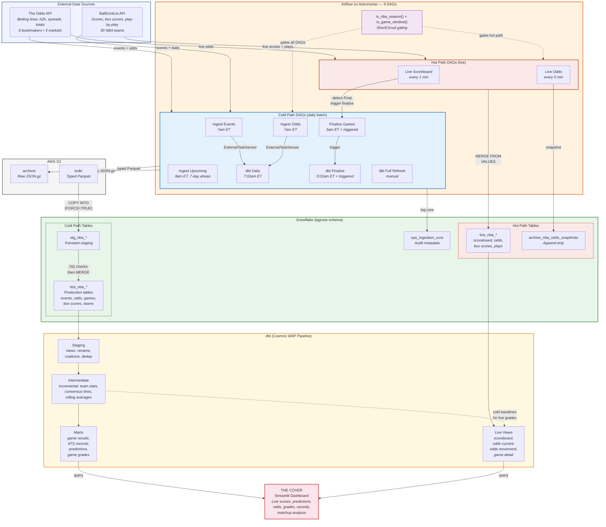

# NBA Spread-Beating Analytics Pipeline

End-to-end architecture: two external APIs feed a hot/cold dual-path Airflow pipeline on Astronomer, transforming data through dbt into Snowflake, and serving a Streamlit dashboard for spread cover analysis.

**Legend:** Blue = cold path (daily batch) | Orange/Red = hot path (live) | Green = Snowflake | Yellow = dbt | Pink = dashboard

**Key flows:**
- **Cold path:** APIs → Airflow (7am/3am ET) → S3 archive + Parquet → Snowflake staging → DQ validation → MERGE into `hist_nba_*` → dbt WAP → marts
- **Hot path:** APIs → Airflow (1-5 min) → Python validation → `MERGE FROM VALUES` into `live_nba_*` → dbt live views
- **Convergence:** Live scoreboard detects game Final → triggers cold-path finalize → dbt rebuild (~10-20 min)
- **Dashboard:** Streamlit queries both mart tables (predictions, grades, records) and live views (scoreboard, odds)
