<div align="center">

# THE COVER

### NBA Spread-Beating Analytics Platform

**End-to-end real-time NBA betting analytics — from API to insight in under 60 seconds**

[](https://python.org)
[](https://airflow.apache.org)
[](https://getdbt.com)
[](https://snowflake.com)
[](https://aws.amazon.com/s3/)
[](https://streamlit.io)
[](https://plotly.com)
[](https://arrow.apache.org/docs/python/)

`1M+ rows ingested` &nbsp; `26 dbt models` &nbsp; `9 Airflow DAGs` &nbsp; `1-min live refresh` &nbsp; `2 API sources` &nbsp; `3 NBA seasons`

</div>

---

## What Is This?

**THE COVER** is a production-grade analytics platform that ingests NBA betting odds and game data from two independent APIs, computes composite spread predictions backed by Dean Oliver's Four Factors, grades team and player performance against rolling baselines, and serves everything through a live dashboard that refreshes every 60 seconds.

Most sports analytics platforms tell you *what happened*. This one tells you what *should* have happened, whether to bet on it, and grades the result — all with zero manual intervention. When a game goes Final, an event-driven trigger chain automatically reconciles historical data, rebuilds dbt models through a Write-Audit-Publish pipeline, and refreshes analytics marts within 10-20 minutes.

The system runs on a **dual hot/cold path architecture**: a cold path providing durable, audited historical records with full S3 archival and data quality gates, and a hot path delivering sub-minute live updates via direct MERGE FROM VALUES to Snowflake. Nine coordinated Airflow DAGs handle everything from daily batch ingestion to minute-by-minute live scoring, with cross-DAG sensors, event-driven triggers, and scheduled safety nets ensuring no data is ever lost.

---

## Dashboard

<table>
<tr>
<td width="50%">
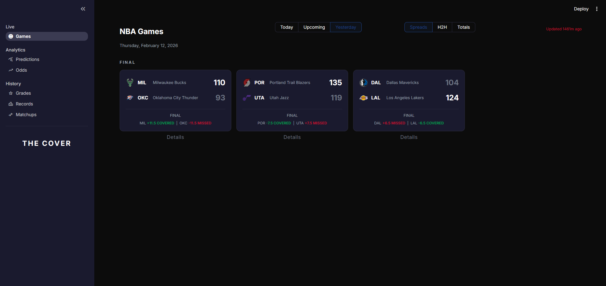
<p align="center"><b>Game Results</b> — Final scores with spread cover results (COVERED / MISSED)</p>
</td>
<td width="50%">
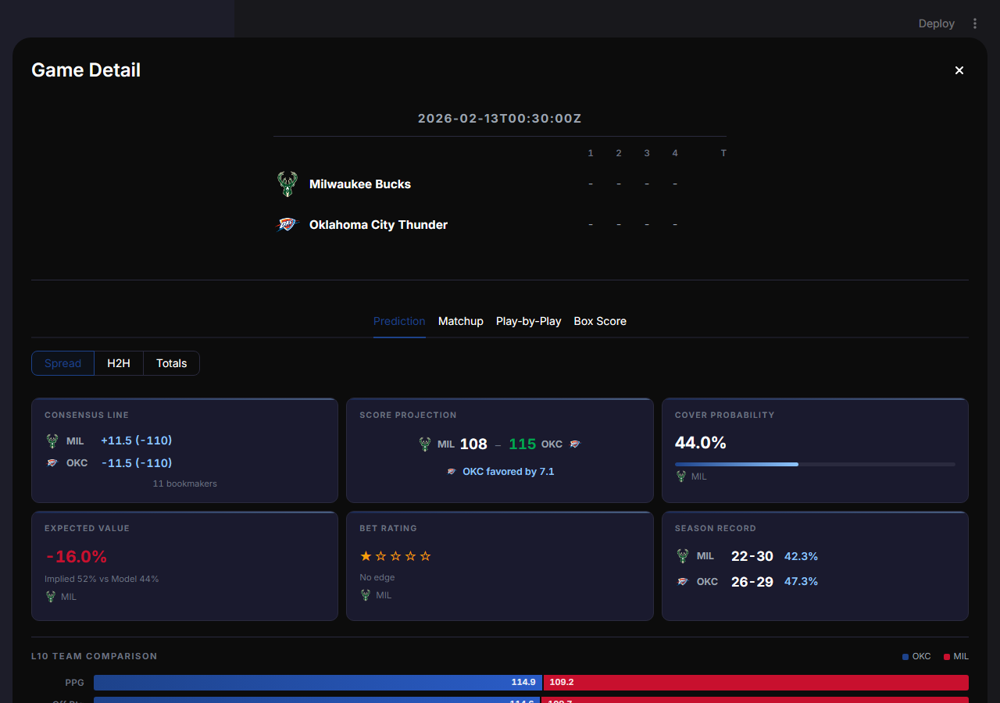
<p align="center"><b>Predictions</b> — Consensus lines, cover probability, expected value, bet ratings</p>
</td>
</tr>
<tr>
<td width="50%">
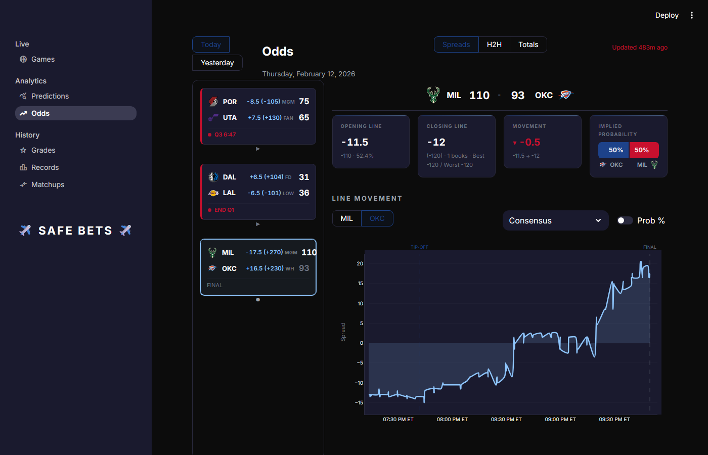
<p align="center"><b>Odds Tracker</b> — Line movement charts with TIP-OFF / FINAL markers</p>
</td>
<td width="50%">
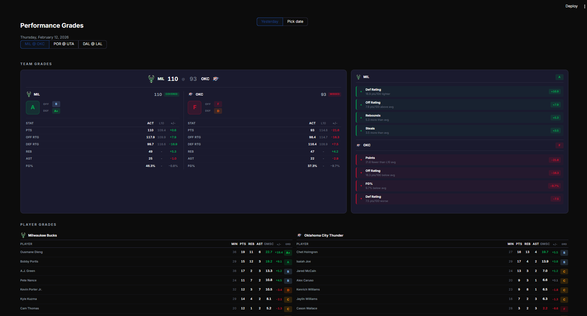
<p align="center"><b>Performance Grades</b> — Team and player letter grades with stat deltas vs L10 baseline</p>
</td>
</tr>
</table>

<details>
<summary><b>More Screenshots</b> (click to expand)</summary>
<br/>

<table>
<tr>
<td width="50%">
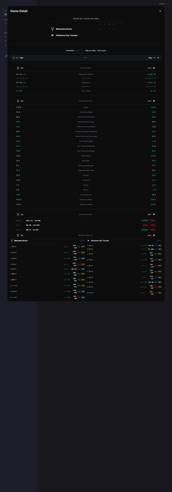
<p align="center"><b>Matchup Analysis</b> — ATS records, team stat comparison bars, H2H series, recent results</p>
</td>
<td width="50%">
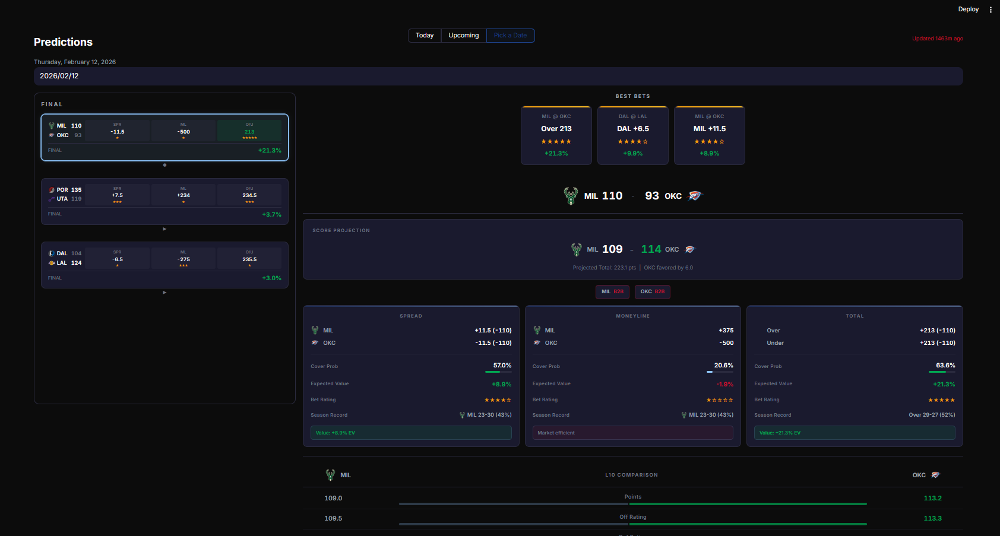
<p align="center"><b>Predictions Full Page</b> — Best bets strip, market cards, score projection, L10 comparison</p>
</td>
</tr>
<tr>
<td width="50%">
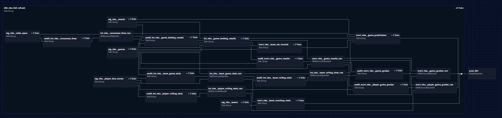
<p align="center"><b>dbt Model DAG</b> — 26 models across staging, intermediate, marts with audit companions</p>
</td>
<td width="50%">
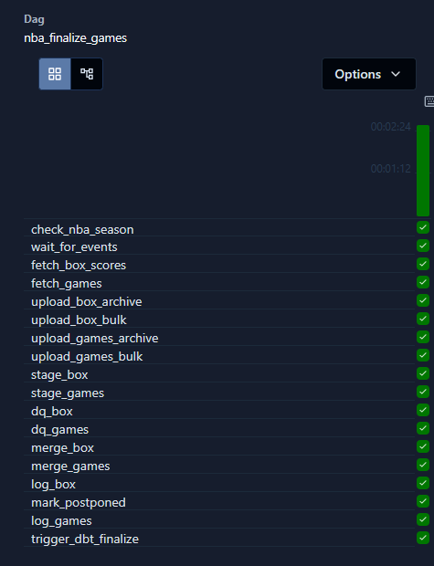
<p align="center"><b>Airflow DAG Run</b> — nba_finalize_games: 19 tasks, all green</p>
</td>
</tr>
</table>

</details>

---

## Deployment

<table>
<tr>
<td width="50%">
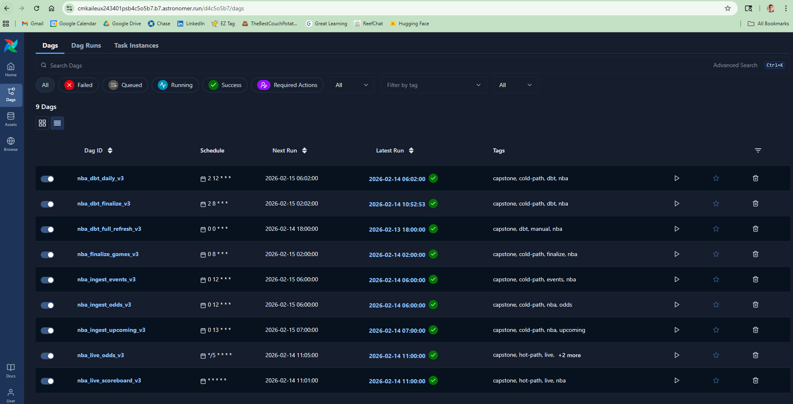
<p align="center"><b>Astronomer Cloud</b> — All 9 DAGs deployed and running (green latest runs)</p>
</td>
<td width="50%">
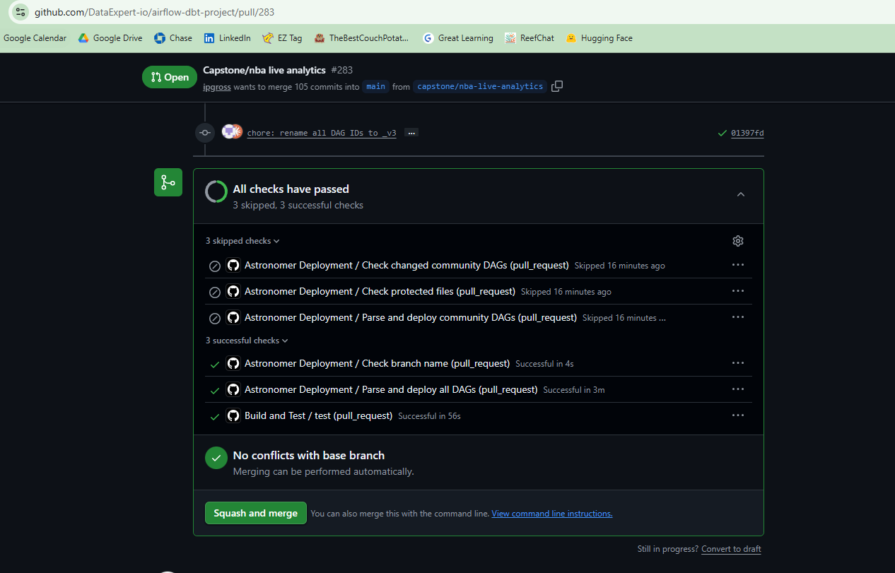
<p align="center"><b>GitHub PR #283</b> — All CI checks passed (build, deploy, branch name)</p>
</td>
</tr>
</table>

---

## Table of Contents

- [Architecture Overview](#architecture-overview)
- [Tech Stack & Justifications](#tech-stack--justifications)
- [Airflow Orchestration](#airflow-orchestration)
- [dbt Transformation Layer](#dbt-transformation-layer)
- [Data Model & Dictionary](#data-model--dictionary)
- [Predictions & Grading Engine](#predictions--grading-engine)
- [Data Quality Strategy](#data-quality-strategy)
- [Scale & Performance](#scale--performance)
- [Challenges & Learnings](#challenges--learnings)
- [Future Enhancements](#future-enhancements)
- [Project Structure](#project-structure)

---

## Architecture Overview

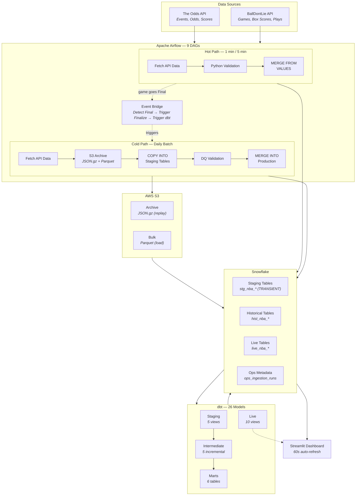

### Hot Path vs Cold Path

| | Cold Path | Hot Path |
|---|---|---|
| **Purpose** | Durable historical system of record | Real-time dashboard serving |
| **Latency** | Daily batch (7 AM / 3 AM ET) | 1 min (scores), 5 min (odds) |
| **Storage** | S3 → Snowflake staging → production | Direct to Snowflake (no S3) |
| **Quality** | Full DQ validation + audit logging | Python-side validation only |
| **Tables** | `hist_nba_*` | `live_nba_*` |
| **Pattern** | COPY INTO → DQ → MERGE | MERGE FROM VALUES |
| **Archival** | JSON.gz (replay) + Parquet (load) | Archive odds snapshots only |

### Event-Driven Bridge

The hot and cold paths aren't isolated — they're connected by an **event-driven trigger chain**:

1. `nba_live_scoreboard` runs every 1 minute during game hours
2. Before and after each MERGE, it compares game statuses
3. When a game transitions from "In Progress" to "Final", it calls `trigger_dag("nba_finalize_games")`
4. The finalize DAG fetches final scores + box scores through the full cold-path pipeline (S3 → staging → DQ → MERGE)
5. After both branches complete, `TriggerDagRunOperator` fires `nba_dbt_finalize`
6. dbt rebuilds all downstream models through WAP quality gates

**Result:** ~10-20 minutes from final whistle to refreshed analytics marts.
**Safety net:** A 3 AM scheduled run catches any missed triggers — belt and suspenders.

---

## Tech Stack & Justifications

| Technology | Role | Why This Choice |
|:---|:---|:---|
| **Apache Airflow** | Orchestration | Cross-DAG coordination via `ExternalTaskSensor`, `TriggerDagRunOperator`, and event-driven `trigger_dag()`. Separate hot/cold schedules with retry logic and alerting. Deployed on Astronomer with GitHub auto-deploy. |
| **dbt + Cosmos** | Transformation | Write-Audit-Publish quality gates with audit companion tables. Incremental MERGE strategy. `TestBehavior.AFTER_EACH` prevents bad data propagation. Cosmos integrates dbt into Airflow DAGs with model selection by graph. |
| **Snowflake** | Data Warehouse | `COPY INTO` for bulk Parquet loads, `MERGE` for atomic upserts, `TRANSIENT` staging tables for lower cost. Zero-maintenance scaling during live game surges. |
| **AWS S3** | Object Storage | Dual-format archival: JSON.gz preserves raw API responses for replay capability, Parquet provides typed columnar data for efficient Snowflake ingestion. |
| **PyArrow** | Serialization | Typed Parquet schemas defined in Python prevent casting errors at load time. Columnar format minimizes file size and maximizes Snowflake `COPY INTO` performance. |
| **Streamlit + Plotly** | Dashboard | `@st.fragment(run_every="60s")` enables auto-refresh on live data without full page reloads. Plotly renders interactive line movement charts with TIP-OFF/FINAL markers. |
| **Python** | Ingestion | `ThreadPoolExecutor` for concurrent multi-date API fetches. Custom validation layer for hot-path data quality. Rate limiting with exponential backoff. |

---

## Airflow Orchestration

### DAG Inventory

| DAG | Path | Schedule | Source | Purpose |
|:---|:---:|:---|:---|:---|
| `nba_ingest_events` | Cold | 7:00 AM ET daily | The Odds API | Game schedule and events |
| `nba_ingest_odds` | Cold | 7:00 AM ET daily | The Odds API | Morning-line odds (h2h, spreads, totals) |
| `nba_finalize_games` | Cold | 3:00 AM ET + event-triggered | BallDontLie | Final scores + box scores + postponed detection |
| `nba_ingest_upcoming` | Cold | 8:00 AM ET daily | The Odds API | 7-day lookahead: events + odds for upcoming games |
| `nba_live_scoreboard` | Hot | Every 1 min | BallDontLie | Live scores + box scores + play-by-play |
| `nba_live_odds` | Hot | Every 5 min | The Odds API | Live odds + archive snapshots for line movement |
| `nba_dbt_daily` | dbt | 7:02 AM ET daily | dbt (Cosmos) | WAP rebuild after events + odds ingestion |
| `nba_dbt_finalize` | dbt | 3:02 AM ET + event-triggered | dbt (Cosmos) | WAP rebuild after game finalization |
| `nba_dbt_full_refresh` | dbt | Manual trigger | dbt (Cosmos) | Full-refresh rebuild of all models |

### Cross-DAG Coordination

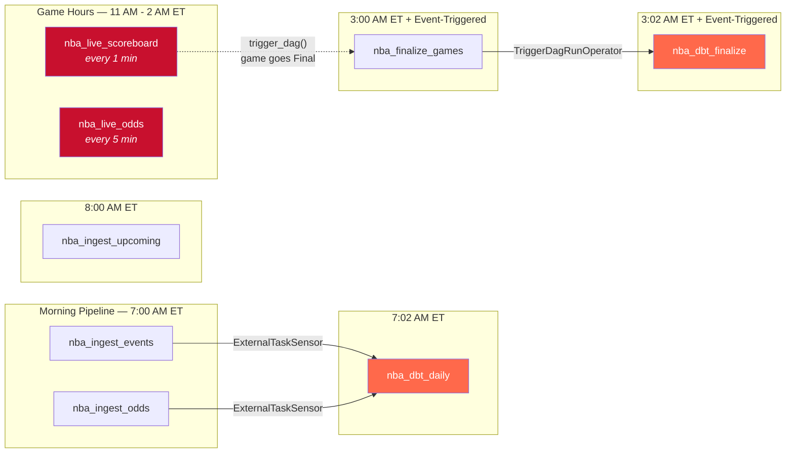

### Event-Driven Trigger Flow

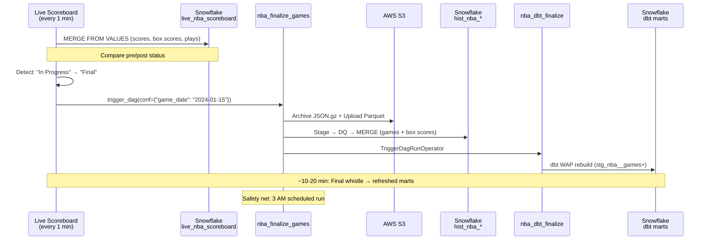

<details>
<summary><b>Airflow DAG Run — nba_finalize_games</b> (click to expand)</summary>
<br/>

The most complex DAG: parallel branches for games + box scores, each with stage → DQ → MERGE, converging to trigger dbt.


All 19 tasks green — from `check_nba_season` through parallel fetch/archive/stage/DQ/merge branches to `trigger_dbt_finalize`.

</details>

### Idempotency Strategy

Every cold-path ingestion follows a **5-step staging → DQ → MERGE** pattern that guarantees identical results on re-run:

```
Step 1: DELETE FROM stg_* WHERE ds = '{date}'     ← Clear stale staging data
Step 2: COPY INTO stg_* ... FORCE=TRUE             ← Bypass Snowflake's 64-day load history
Step 3: Run DQ checks on stg_*                     ← Raises ValueError → Airflow retry on failure
Step 4: MERGE INTO hist_* FROM stg_*               ← Atomic upsert (matched=UPDATE, unmatched=INSERT)
Step 5: DELETE stg_* + INSERT ops.ingestion_runs   ← Cleanup + audit trail
```

**Key design decisions:**

- **FORCE=TRUE on COPY INTO** — Snowflake's default load history silently skips previously-loaded files, which broke idempotency on re-runs. `FORCE=TRUE` ensures every run loads fresh data.
- **TRANSIENT staging tables** — No fail-safe period means lower storage cost. Staging is ephemeral by design.
- **Self-healing deduplication** — A defensive `DELETE` removes any existing duplicates before MERGE, preventing compound errors on re-run.
- **Empty classification** — Zero records on an off-day is `EMPTY_EXPECTED` (task succeeds, logged to ops). Zero records when games should exist is `EMPTY_UNEXPECTED` (raises error, Airflow retries).
- **Ops metadata** — Every run is logged to `ops_ingestion_runs` with status, row count, and elapsed time for observability.

---

## dbt Transformation Layer

### Model Lineage

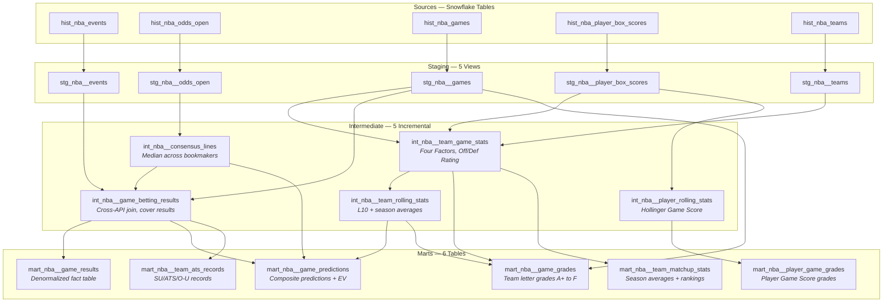

*Additionally, 10 **live views** sit on top of the hot-path tables to serve real-time data to the dashboard.*

### Layer Details

<details>
<summary><b>Staging Layer — 5 Views</b> (click to expand)</summary>

| Model | Grain | Key Logic |
|:---|:---|:---|
| `stg_nba__events` | event_id x game_date | Rename columns, coalesce postponed flag to FALSE |
| `stg_nba__odds_open` | event x bookmaker x market x outcome | Compute implied probability via macro, `QUALIFY` dedup on latest `ingested_at` |
| `stg_nba__games` | game_id x game_date | Filter to `status = 'Final'`, compute `score_margin` and `total_points` |
| `stg_nba__player_box_scores` | game x player | Parse minutes `MM:SS` → decimal via macro, coalesce all stats to 0 |
| `stg_nba__teams` | team_id | Simple rename, 30 rows |

All staging models are **views** — zero storage cost, always fresh.

</details>

<details>
<summary><b>Intermediate Layer — 5 Incremental Models</b> (click to expand)</summary>

| Model | Grain | Key Logic |
|:---|:---|:---|
| `int_nba__team_game_stats` | game x team (2 rows/game) | Aggregate player → team. Self-join for opponent stats. Compute **Four Factors** (eFG%, TOV%, ORB%, FTR), Off/Def Rating, estimated possessions. |
| `int_nba__consensus_lines` | event x market x side | **MEDIAN** price and line across all bookmakers. Track best/worst price, min/max line, bookmaker count. |
| `int_nba__game_betting_results` | game x market x side | **Cross-API join** on `(game_date, home_team)`. Compute cover result (COVERED / MISSED / PUSH) for spreads, h2h, and totals. |
| `int_nba__team_rolling_stats` | game x team | **L10 rolling** + **season averages** using `ROWS BETWEEN 10 PRECEDING AND 1 PRECEDING` (excludes current game). Rest days. Opponent Four Factors. |
| `int_nba__player_rolling_stats` | game x player | L10 + season averages. **Hollinger Game Score** calculation. |

All intermediate models use **incremental materialization** with `merge` strategy and composite unique keys.

</details>

<details>
<summary><b>Marts Layer — 6 Models</b> (click to expand)</summary>

| Model | Grain | Materialization | Key Logic |
|:---|:---|:---:|:---|
| `mart_nba__game_results` | game_id | Incremental | Central fact table. Pivots spreads/totals/h2h to wide format. Computes winner. |
| `mart_nba__game_predictions` | event x market x side | Incremental | **Composite predictions** with 4 signals per market. Expected value. 1-5 star bet ratings. |
| `mart_nba__game_grades` | game x team | Incremental | Actual vs L10 deltas. Offensive, defensive, and overall **letter grades** (A+ to F). |
| `mart_nba__player_game_grades` | game x player | Incremental | Hollinger Game Score deltas. Player letter grades. |
| `mart_nba__team_ats_records` | season x team | Table | SU/ATS/O-U records with home/away splits. Rankings within season. |
| `mart_nba__team_matchup_stats` | season x team | Table | Season averages. Off/Def rating rankings. Home/away splits. |

</details>

<details>
<summary><b>Live Layer — 10 Views</b> (click to expand)</summary>

The live layer provides **real-time views** on hot-path tables — no dbt run needed, always fresh:

| Model | Purpose |
|:---|:---|
| `live_nba__scoreboard` | Current game states (status, period, clock, scores) |
| `live_nba__player_box_scores` | Live player stats |
| `live_nba__team_box_scores` | Aggregated player → team (VIEW, mirrors cold-path logic) |
| `live_nba__plays` | Play-by-play feed (2025+ season) |
| `live_nba__odds_current` | Per-bookmaker odds enriched with consensus (median) |
| `live_nba__odds_movement` | Append-only archive for line movement charts |
| `live_nba__game_detail` | Composite: scoreboard + team stats + consensus spread (single query) |
| `live_nba__game_results` | Instant cover results when game ends (before cold path runs) |
| `live_nba__game_grades` | **Hybrid**: live actuals from hot path + rolling baselines from cold path |
| `live_nba__player_game_grades` | Same hybrid pattern for player grades |

**Hybrid design**: Live grades use real-time actuals from the hot path but reference cold-path rolling stats as baselines. Trade-off: instant grades with baselines that may be ~1 game stale, vs waiting 10-20 hours for exact values.

</details>

### Write-Audit-Publish (WAP) Pattern

Every incremental intermediate and mart model implements **WAP** — a production pattern that prevents bad data from reaching downstream consumers:

```
1. Audit table (audit_int_nba__team_game_stats) filters to today's batch
2. dbt tests run against the audit table
3. If ALL tests pass → production model reads from audit via 
4. If ANY test fails → dbt stops, downstream models are NOT rebuilt
```

Combined with **`TestBehavior.AFTER_EACH`** in Cosmos, this creates a cascading quality gate: each model must pass its tests before any downstream model begins. Bad data never propagates.

### Custom Macros

| Macro | Purpose |
|:---|:---|
| `safe_divide(num, denom)` | Division with `NULLIF(denom, 0)` protection |
| `parse_minutes(col)` | Convert `"MM:SS"` string → decimal minutes |
| `american_odds_to_implied_prob(col)` | Convert American odds (+150, -110) to probability |
| `calculate_expected_value(prob, odds)` | `(win_prob x payout) - (1 - win_prob)` |
| `performance_grade(delta)` | Map stat delta to letter grade (A+ through F) |

### Advanced Metrics

The intermediate layer computes research-backed basketball analytics:

- **Dean Oliver's Four Factors** — The four statistical categories that most correlate with winning:
  - Effective FG% (40% weight), Turnover Rate (25%), Offensive Rebound Rate (20%), Free Throw Rate (15%)
- **Estimated Possessions** — `FGA + 0.475 x FTA - OREB + TOV`
- **Offensive / Defensive Rating** — Points per 100 possessions (adjusts for pace)
- **Hollinger Game Score** — Single-number player performance metric:
  - `PTS + 0.4*FGM - 0.7*FGA - 0.4*(FTA-FTM) + 0.7*OREB + 0.3*DREB + STL + 0.7*AST + 0.7*BLK - 0.4*PF - TOV`

---

## Data Model & Dictionary

### Entity Relationship Diagram

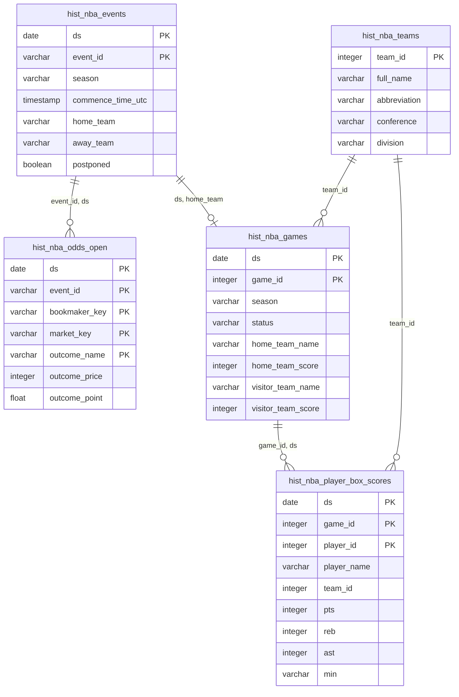

> **Cross-API Join Note:** The Odds API and BallDontLie share no common game ID. The join key is `(game_date, home_team_name)` — which works because NBA teams play at most once per day, and team names are normalized at ingestion via `TEAM_NAME_MAP`.

### Table Dictionary

<details>
<summary><b>Cold Path — Historical Tables</b></summary>

| Table | Grain | Primary Key | ~Rows/Season | Source |
|:---|:---|:---|---:|:---|
| `hist_nba_events` | 1 row per game per date | `(ds, event_id)` | 1,320 | The Odds API |
| `hist_nba_odds_open` | 1 row per game x bookmaker x market x outcome | `(ds, event_id, bookmaker_key, market_key, outcome_name)` | 1,400,000+ | The Odds API |
| `hist_nba_games` | 1 row per game per date | `(ds, game_id)` | 1,320 | BallDontLie |
| `hist_nba_player_box_scores` | 1 row per game x player | `(ds, game_id, player_id)` | 475,000+ | BallDontLie |
| `hist_nba_teams` | 1 row per team | `(team_id)` | 30 | BallDontLie |

</details>

<details>
<summary><b>Hot Path — Live Tables</b></summary>

| Table | Grain | Primary Key | Refresh | Retention |
|:---|:---|:---|:---|:---|
| `live_nba_scoreboard` | 1 row per game | `(game_id)` | 1 min | 2 days |
| `live_nba_player_box_scores` | 1 row per game x player | `(game_id, player_id)` | 1 min | 2 days |
| `live_nba_plays` | 1 row per game x play | `(game_id, play_id)` | 1 min | 2 days |
| `live_nba_odds` | 1 row per event x bookmaker x market x outcome | `(event_id, bookmaker_key, market_key, outcome_name)` | 5 min | 2 days |
| `archive_nba_odds_snapshots` | Append-only snapshots | None (append) | 5 min | Permanent |

</details>

<details>
<summary><b>dbt Marts</b></summary>

| Table | Grain | Materialization | Purpose | Consumer |
|:---|:---|:---:|:---|:---|
| `mart_nba__game_results` | game_id | Incremental | Central fact: scores + all betting outcomes | Games page |
| `mart_nba__game_predictions` | event x market x side | Incremental | Composite predictions with EV and star ratings | Predictions page |
| `mart_nba__game_grades` | game x team | Incremental | Team performance grades (A+ to F) | Grades page |
| `mart_nba__player_game_grades` | game x player | Incremental | Player Game Score grades | Grades page |
| `mart_nba__team_ats_records` | season x team | Table | SU/ATS/O-U records with splits | Records page |
| `mart_nba__team_matchup_stats` | season x team | Table | Averages, splits, rankings | Matchups page |

</details>

---

## Predictions & Grading Engine

### Composite Prediction Model

Each prediction combines multiple statistical signals into a cover probability, then computes expected value against the market line. All signals use **point-in-time data only** — each team's rolling stats reflect their last game *before* the event, preventing data leakage.

#### Spread Predictions (4 Signals)

| Signal | Logic | Max Impact |
|:---|:---|---:|
| **Projected Edge** | `(team_off_rating + opp_def_rating) / 2` comparison between teams. +1.5% per projected point. | ±12% |
| **Four Factors Matchup** | Dean Oliver weights: eFG% (40%), TOV% (25%), ORB% (20%), FTR (15%). Compare team strengths vs opponent weaknesses. | ±8% |
| **Rest Days** | Back-to-back penalty: -2% for the tired team. | -2% |
| **ATS Track Record** | Season ATS cover rate, dampened toward 50% to avoid overfitting. | ±3% |

**Base:** 50% &nbsp;|&nbsp; **Clamped:** 30% – 70%

#### Moneyline Predictions (3 Signals)

| Signal | Logic | Max Impact |
|:---|:---|---:|
| **Market Implied Probability** | Used as the base instead of 50% — respects market efficiency. | Base |
| **Four Factors** | Lighter weight than spreads — markets already price team quality. | ±6% |
| **Rest Days** | Same back-to-back logic. | -2% |

**Clamped:** 10% – 90%

#### Totals Predictions (3 Signals)

| Signal | Logic | Max Impact |
|:---|:---|---:|
| **Total Edge** | Compare projected total vs market line. +1.5% per point. | ±12% |
| **Pace** | Deviation from league-average possessions (97). Fast pace → lean Over. | ±5% |
| **O/U Record** | Season over/under record, dampened. | ±3% |

**Base:** 50% &nbsp;|&nbsp; **Clamped:** 30% – 70%

#### Expected Value & Bet Rating

```
Expected Value = (cover_prob x payout) - (1 - cover_prob)

Payout (positive odds): odds / 100
Payout (negative odds): 100 / |odds|
```

| Stars | EV Threshold | Label |
|:---:|---:|:---|
| 5 | ≥ 10% | Strong edge |
| 4 | ≥ 5% | Good value |
| 3 | ≥ 2% | Slight edge |
| 2 | ≥ 0% | Marginal |
| 1 | < 0% | No edge |

### Performance Grading System

Post-game grades measure how a team or player performed **relative to their own baseline** — not absolute quality.

**Methodology:**
1. Compute delta: `actual_stat - L10_rolling_average`
2. For defensive rating: **invert** the delta (lower rating = better defense)
3. Map delta to letter grade:

| Grade | Delta Threshold | Meaning |
|:---:|:---:|:---|
| **A+** | ≥ 15 | Elite performance vs recent baseline |
| **A** | ≥ 8 | Well above average |
| **B** | ≥ 3 | Slightly above average |
| **C** | ≥ -3 | On par with baseline |
| **D** | ≥ -8 | Below average |
| **F** | < -8 | Significantly underperformed |

**Team grades** combine offensive rating delta and inverted defensive rating delta.
**Player grades** use Hollinger Game Score delta vs their L10 average Game Score.

---

## Data Quality Strategy

Data quality is enforced at **four layers**, from ingestion to transformation:

```
┌─────────────────────────────────────────────────────────┐
│  Layer 4: Cross-Reference Validation                     │
│  Games count ≤ events count (accounts for postponements) │
│  Box score game count ≥ staging game count               │
├─────────────────────────────────────────────────────────┤
│  Layer 3: dbt Tests (26 models)                          │
│  unique, not_null, accepted_values, relationships        │
│  Custom: score ranges, probability bounds, grade values  │
│  WAP: TestBehavior.AFTER_EACH blocks bad propagation     │
├─────────────────────────────────────────────────────────┤
│  Layer 2: Snowflake DQ (Cold Path Staging)               │
│  has_data, no_nulls, no_duplicates, single_date_only     │
│  scores_not_too_low (>50), scores_not_too_high (<200)    │
│  makes_lte_attempts (FGM≤FGA, FTM≤FTA)                  │
├─────────────────────────────────────────────────────────┤
│  Layer 1: Python Validation (Hot Path)                   │
│  Type checks, range validation, non-negative stats       │
│  Score range 0-300, points ≤ 100 per player              │
│  Odds price validation, spread range |x| ≤ 300          │
└─────────────────────────────────────────────────────────┘
```

**Empty data classification** distinguishes expected from unexpected:
- **`EMPTY_EXPECTED`**: Zero records on an NBA off-day → task succeeds, status logged to ops table
- **`EMPTY_UNEXPECTED`**: Zero records when games should exist → raises `ValueError`, Airflow retries up to 2x

---

## Scale & Performance

| Metric | Value |
|:---|---:|
| Player box scores per season | **475,000+** |
| Historical odds rows | **1,400,000+** |
| Live odds archive snapshots (full season) | **~85,000,000** |
| Games tracked per season | **1,320+** |
| NBA seasons covered | **3** (2023-24, 2024-25, 2025-26) |
| Live refresh latency (scores) | **1 minute** |
| Live refresh latency (odds) | **5 minutes** |
| Event-driven latency (Final → marts) | **10-20 minutes** |
| dbt models | **26** |
| Airflow DAGs | **9** |
| Estimated monthly API cost | **~$30** |

### Cost Optimization

| Strategy | Impact |
|:---|:---|
| **FREE endpoints** for current/future events | 0 credits for ~60% of event fetches |
| **Off-season short-circuit** | `is_nba_season()` check skips all API calls outside season dates |
| **Game-window gating** | `is_game_window()` limits live DAGs to 11 AM – 2 AM ET only |
| **Smart endpoint selection** | Historical (past), scores (today after 10am), regular (future) — always cheapest option |
| **TRANSIENT staging tables** | No Snowflake fail-safe period → lower storage cost |
| **Incremental dbt** | Only process new dates — no daily full-refresh needed |
| **Skip dates with no games** | Upcoming pipeline queries events first, skips odds fetch if no games |

---

## Challenges & Learnings

Eight real-world data engineering problems encountered and solved:

### 1. Cross-API Join With No Common ID

**Challenge:** The Odds API and BallDontLie have no shared game identifier. Events use string IDs like `abc123def456`, while games use integer IDs like `473028`.

**Solution:** Team name normalization at ingestion (`TEAM_NAME_MAP` converts "Los Angeles Clippers" → "LA Clippers") plus a join on `(game_date, home_team_name)`. This works because NBA teams play at most once per day, and the home team is unambiguous.

**Result:** All cross-API joins work with simple equality — no fuzzy matching needed.

### 2. Historical API Point-in-Time Snapshots

**Challenge:** The Odds API's historical endpoint returns a point-in-time snapshot — games that have already completed are removed from the response. A late snapshot (11:59 PM UTC) misses afternoon games.

**Solution:** Query at `T12:00:00Z` (7 AM ET) when all games are still pre-match and present in the API response.

### 3. Snowflake 64-Day COPY INTO History

**Challenge:** Snowflake tracks which files have been loaded via `COPY INTO` for 64 days. Re-running a pipeline silently skips already-loaded files, breaking idempotency.

**Solution:** `FORCE=TRUE` on all `COPY INTO` statements. Every run loads fresh data regardless of load history.

### 4. Postponed Games Breaking DQ

**Challenge:** The games DQ check cross-references the events table for expected game count. Postponed games exist in events but not in games, causing a count mismatch.

**Solution:** Retroactive `mark_postponed_events()` runs after every games merge, comparing events vs games by `(ds, home_team)`. DQ uses `≤` instead of `=` for the count comparison.

### 5. UTC vs Eastern Time Complexity

**Challenge:** The Odds API uses UTC timestamps. NBA games tipping at 7 PM ET or later fall into the next UTC day, so a single-UTC-day window misses evening games.

**Solution:** Wide UTC windows spanning `5 AM ET → 1 AM ET next day` in API parameters, with client-side Eastern time filtering as a safety net.

### 6. Rolling Stats in Incremental Context

**Challenge:** Incremental dbt runs only see new rows, but rolling L10 averages need 10 prior games as context. Without historical context, the first games in each incremental batch have incorrect averages.

**Solution:** The audit table pulls a 30-day lookback window (enough for ~15 games) to provide rolling context, then filters the output to only new rows. The window computation is correct, but only current-batch rows are published.

### 7. BallDontLie Sentinel Coordinates

**Challenge:** The BDL plays endpoint returns `-214748340` (a near-min 32-bit integer) when coordinates aren't available, rather than null.

**Solution:** Detect the sentinel value during Python validation and convert to `NULL` before Snowflake ingestion.

### 8. Empty vs Missing Data

**Challenge:** Zero records can mean "no games today" (expected on off-days) or "API failed to return data" (a real problem). Both look the same to a naive check.

**Solution:** Two-tier classification:
- `EMPTY_EXPECTED`: Off-season or off-day → task succeeds, logged to ops
- `EMPTY_UNEXPECTED`: Season is active and games should exist → `ValueError` raised, Airflow retries

---

## Future Enhancements

**Near-Term**
- Closing Line Value (CLV) tracking — compare opening prediction vs final closing line
- Player props market predictions
- Historical grades backfill for full-season analysis

**Mid-Term**
- ML-based predictions using gradient boosting on Four Factors features
- Injury impact modeling (adjust projections for missing players)
- Play-by-play situational analysis (clutch time, garbage time filtering)

**Long-Term**
- WebSocket ingestion for sub-second live updates
- Multi-sport expansion (NFL, MLB using same architecture)
- Public API serving predictions to external consumers

---

## Project Structure

```
airflow-dbt-project/
├── dags/capstone/                          # Airflow DAGs
│   ├── nba_ingest_events_dag.py            #   Cold: daily events (7 AM ET)
│   ├── nba_ingest_odds_dag.py              #   Cold: morning-line odds (7 AM ET)
│   ├── nba_finalize_games_dag.py           #   Cold: scores + box scores (3 AM + event-triggered)
│   ├── nba_ingest_upcoming_dag.py          #   Cold: 7-day lookahead (8 AM ET)
│   ├── nba_live_scoreboard_dag.py          #   Hot: live scores (every 1 min)
│   ├── nba_live_odds_dag.py                #   Hot: live odds (every 5 min)
│   ├── nba_dbt_daily_dag.py                #   dbt: WAP after events+odds
│   ├── nba_dbt_finalize_dag.py             #   dbt: WAP after finalization
│   └── nba_dbt_full_refresh_dag.py         #   dbt: manual full-refresh
│
├── include/capstone/                        # Shared Python modules
│   ├── config.py                            #   Credentials, table names, season dates, team normalization
│   ├── api_client.py                        #   The Odds API client (cold + live)
│   ├── balldontlie_client.py                #   BallDontLie client (cold + live)
│   ├── storage.py                           #   S3: JSON.gz archives + Parquet bulk via PyArrow
│   ├── database/                            #   Snowflake operations (refactored from 1,537-line monolith)
│   │   ├── connection.py                    #     Connection + Parquet stage setup
│   │   ├── cold_path.py                     #     Stage, validate, merge for hist_* tables
│   │   ├── hot_path.py                      #     MERGE FROM VALUES for live_* tables
│   │   ├── dq.py                            #     DQ runner + validation functions
│   │   └── ops.py                           #     Ingestion logging + empty classification
│   ├── dag_tasks.py                         #   Cold-path task factory (eliminates boilerplate)
│   ├── callbacks.py                         #   Failure alerting (on_failure_callback)
│   └── scripts/                             #   Manual DDL scripts for Snowflake setup
│
├── dbt_project/models/nba/                  # dbt models (26 total)
│   ├── staging/                             #   5 views (1:1 source mapping)
│   ├── intermediate/                        #   5 incremental (heavy transforms)
│   ├── marts/                               #   6 tables (dashboard-ready)
│   └── live/                                #   10 views (real-time hot-path)
│
├── dbt_project/macros/nba/                  # 5 custom macros
│
├── streamlit_app/                           # Dashboard ("THE COVER")
│   ├── app.py                               #   Main entry + navigation
│   ├── app_pages/                           #   6 pages (Games, Predictions, Odds, Grades, Records, Matchups)
│   ├── components/                          #   Reusable HTML renderers
│   ├── queries/                             #   Snowflake SQL queries
│   └── data/                                #   Static data (team logos, abbreviations)
│
└── archive/old_dags/                        # Retired v1 DAGs (reference only)
```

### Module Responsibilities

| Module | Purpose |
|:---|:---|
| `config.py` | Credentials, table names (`HIST_*`, `STG_*`, `LIVE_*`), S3 prefixes, season dates, `TEAM_NAME_MAP`, `normalize_team_name()`, `is_game_window()`, `is_nba_season()` |
| `api_client.py` | The Odds API: `fetch_events_for_date()`, `fetch_odds_for_date()`, `fetch_live_odds()`. Smart endpoint selection. Rate limiting. Team name normalization at fetch time. |
| `balldontlie_client.py` | BallDontLie: `fetch_games_for_date()`, `fetch_box_scores_for_date()`, `fetch_live_games()`, `fetch_live_box_scores()`, `fetch_live_plays()`. Pagination. 3-retry logic. |
| `storage.py` | `upload_archive()` → S3 JSON.gz. `upload_bulk()` → PyArrow Parquet with typed schemas. |
| `database/` | Cold: stage/validate/merge per dataset. Hot: `merge_live_*()` with `MERGE FROM VALUES`. DQ runner. Ops logging. |
| `dag_tasks.py` | `build_cold_path_tasks()` factory — generates standard stage → DQ → merge → log task chain, eliminating boilerplate across DAGs. |
| `callbacks.py` | `alert_on_failure()` — structured failure logging for all DAGs (extensible to Slack/PagerDuty). |

---

<div align="center">

Built with data engineering principles: **idempotency**, **observability**, **quality gates**, and **event-driven architecture**.

</div>
