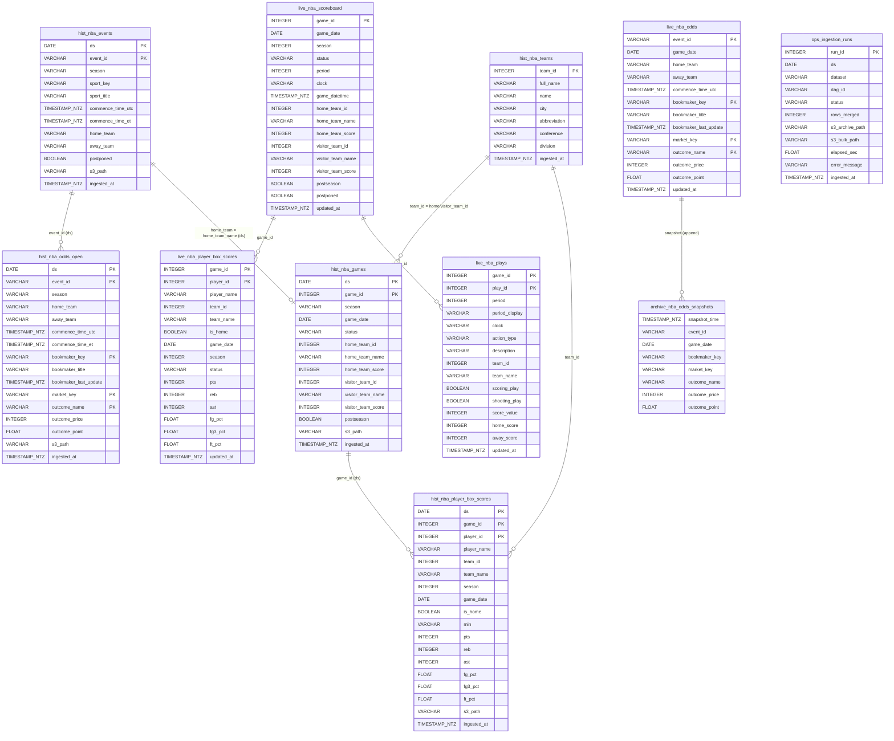

# Data Model: NBA Spread-Beating Analytics Pipeline

**Version:** 1.0
**Date:** 2026-02-16
**Level:** Physical (Snowflake-specific types, constraints, keys)

**Stack:** Snowflake | Apache Airflow | dbt | AWS S3 | PyArrow
**Scale:** 11 active tables + 1 view | 2 external APIs | 5 table namespaces | 30+ dbt models

---

## Entity Summary

| Namespace | Entity | Grain | Source | Refresh |
|-----------|--------|-------|--------|---------|
| **Cold** | `hist_nba_events` | (ds, event_id) | The Odds API | Daily 7am ET |
| **Cold** | `hist_nba_odds_open` | (ds, event_id, bookmaker, market, outcome) | The Odds API | Daily 7am ET |
| **Cold** | `hist_nba_games` | (ds, game_id) | BallDontLie | Daily 3am ET |
| **Cold** | `hist_nba_player_box_scores` | (ds, game_id, player_id) | BallDontLie | Daily 3am ET |
| **Cold** | `hist_nba_teams` | (team_id) | BallDontLie | One-time load |
| **Hot** | `live_nba_scoreboard` | (game_id) | BallDontLie | Every 1 min |
| **Hot** | `live_nba_player_box_scores` | (game_id, player_id) | BallDontLie | Every 1 min |
| **Hot** | `live_nba_plays` | (game_id, play_id) | BallDontLie | Every 1 min |
| **Hot** | `live_nba_odds` | (event_id, bookmaker, market, outcome) | The Odds API | Every 5 min |
| **Archive** | `archive_nba_odds_snapshots` | append-only (no PK) | The Odds API | Every 5 min |
| **Ops** | `ops_ingestion_runs` | (run_id) | Pipeline metadata | Per ingestion |
| **View** | `live_nba_team_box_scores` | (game_id, team_id) | Derived | On-query |

---

## Entity-Relationship Diagram



### Relationship Notes

- **Events ↔ Games:** Cross-API join on `(ds, home_team = home_team_name)`. Team names normalized at ingestion via `TEAM_NAME_MAP` in `config.py`.
- **Events → Odds:** Same API source, joined on `(ds, event_id)`.
- **Games → Box Scores:** Same API source, joined on `(ds, game_id)`.
- **Teams → Games/Box Scores:** Reference join on `team_id`. Teams table is a 30-row reference load.
- **Cold vs Hot:** Cold-path tables use `ds` in composite keys for idempotent date-partitioned MERGE. Hot-path tables omit `ds` for simpler current-state MERGE.

---

## Data Dictionaries

### Cold Path Production Tables

#### `hist_nba_events`

Game schedule from The Odds API. One row per scheduled NBA game per date.

| Column | Type | Null | Key | Default | Description |
|--------|------|------|-----|---------|-------------|
| ds | DATE | No | PK | | Ingestion date (Eastern game date) |
| event_id | VARCHAR(64) | No | PK | | Odds API unique event identifier |
| season | VARCHAR(10) | No | | | Season label (e.g., "2024-25") |
| sport_key | VARCHAR(50) | No | | | Always "basketball_nba" |
| sport_title | VARCHAR(100) | Yes | | NULL | Display name ("NBA") |
| commence_time_utc | TIMESTAMP_NTZ | No | | | Scheduled tip-off in UTC |
| commence_time_et | TIMESTAMP_NTZ | No | | | Scheduled tip-off in Eastern Time |
| home_team | VARCHAR(100) | No | | | Home team (normalized) |
| away_team | VARCHAR(100) | No | | | Away team (normalized) |
| postponed | BOOLEAN | Yes | | FALSE | Set by `mark_postponed_events()` post-MERGE |
| s3_path | VARCHAR(500) | Yes | | NULL | S3 archive path for raw JSON.gz |
| ingested_at | TIMESTAMP_NTZ | No | | CURRENT_TIMESTAMP() | Record creation/update time |

**Primary Key:** `(ds, event_id)`
**Source:** The Odds API `/events` (historical or regular endpoint)
**MERGE Key:** `(ds, event_id)` — `postponed` excluded from MERGE update (managed separately)

---

#### `hist_nba_odds_open`

Morning-line betting odds from The Odds API. One row per event per bookmaker per market per outcome.

| Column | Type | Null | Key | Default | Description |
|--------|------|------|-----|---------|-------------|
| ds | DATE | No | PK | | Ingestion date |
| event_id | VARCHAR(64) | No | PK | | Odds API event identifier |
| season | VARCHAR(10) | No | | | Season label |
| home_team | VARCHAR(100) | No | | | Home team (normalized) |
| away_team | VARCHAR(100) | No | | | Away team (normalized) |
| commence_time_utc | TIMESTAMP_NTZ | No | | | Tip-off UTC |
| commence_time_et | TIMESTAMP_NTZ | No | | | Tip-off Eastern |
| bookmaker_key | VARCHAR(50) | No | PK | | Bookmaker identifier (fanduel, draftkings, etc.) |
| bookmaker_title | VARCHAR(100) | Yes | | NULL | Bookmaker display name |
| bookmaker_last_update | TIMESTAMP_NTZ | Yes | | NULL | When bookmaker last updated this line |
| market_key | VARCHAR(20) | No | PK | | Market type: `h2h`, `spreads`, or `totals` |
| outcome_name | VARCHAR(100) | No | PK | | Team name (h2h/spreads) or "Over"/"Under" (totals) |
| outcome_price | INTEGER | No | | | American odds (e.g., -110, +150) |
| outcome_point | FLOAT | Yes | | NULL | Spread/total line; NULL for h2h |
| s3_path | VARCHAR(500) | Yes | | NULL | S3 archive path |
| ingested_at | TIMESTAMP_NTZ | No | | CURRENT_TIMESTAMP() | Record creation/update time |

**Primary Key:** `(ds, event_id, bookmaker_key, market_key, outcome_name)`
**Source:** The Odds API `/odds` (historical or regular endpoint)
**Markets:** h2h (moneyline), spreads (point spread), totals (over/under)
**Bookmakers:** fanduel, draftkings, betmgm, caesars, pointsbetus, betrivers

---

#### `hist_nba_games`

Final game results from BallDontLie API. One row per completed game.

| Column | Type | Null | Key | Default | Description |
|--------|------|------|-----|---------|-------------|
| ds | DATE | No | PK | | Ingestion date |
| game_id | INTEGER | No | PK | | BallDontLie game identifier |
| season | VARCHAR(10) | No | | | Season label |
| game_date | DATE | No | | | Game date |
| status | VARCHAR(20) | No | | | Always "Final" (filtered at ingestion) |
| home_team_id | INTEGER | No | FK | | BallDontLie team ID |
| home_team_name | VARCHAR(100) | No | | | Home team full name |
| home_team_score | INTEGER | Yes | | NULL | Final home score |
| visitor_team_id | INTEGER | No | FK | | BallDontLie team ID |
| visitor_team_name | VARCHAR(100) | No | | | Away team full name |
| visitor_team_score | INTEGER | Yes | | NULL | Final away score |
| postseason | BOOLEAN | Yes | | FALSE | Playoff game flag |
| s3_path | VARCHAR(500) | Yes | | NULL | S3 archive path |
| ingested_at | TIMESTAMP_NTZ | No | | CURRENT_TIMESTAMP() | Record creation/update time |

**Primary Key:** `(ds, game_id)`
**Source:** BallDontLie API `/games?dates[]={ds}` (status="Final" only)
**DQ:** Scores validated 50-200 range, cross-referenced against events table for expected count

---

#### `hist_nba_player_box_scores`

Player-level game statistics from BallDontLie API. Aggregated to team level in dbt.

| Column | Type | Null | Key | Default | Description |
|--------|------|------|-----|---------|-------------|
| ds | DATE | No | PK | | Ingestion date |
| game_id | INTEGER | No | PK | | BallDontLie game identifier |
| player_id | INTEGER | No | PK | | BallDontLie player identifier |
| player_name | VARCHAR(100) | No | | | Player full name |
| team_id | INTEGER | No | FK | | BallDontLie team ID |
| team_name | VARCHAR(100) | No | | | Team full name |
| season | INTEGER | No | | | Season start year (e.g., 2024) |
| game_date | DATE | No | | | Game date |
| is_home | BOOLEAN | No | | | Whether player's team is home |
| min | VARCHAR(10) | Yes | | NULL | Playing time in "MM:SS" format |
| pts | INTEGER | Yes | | NULL | Points scored |
| reb | INTEGER | Yes | | NULL | Total rebounds |
| oreb | INTEGER | Yes | | NULL | Offensive rebounds |
| dreb | INTEGER | Yes | | NULL | Defensive rebounds |
| ast | INTEGER | Yes | | NULL | Assists |
| stl | INTEGER | Yes | | NULL | Steals |
| blk | INTEGER | Yes | | NULL | Blocks |
| turnover | INTEGER | Yes | | NULL | Turnovers |
| pf | INTEGER | Yes | | NULL | Personal fouls |
| fgm | INTEGER | Yes | | NULL | Field goals made |
| fga | INTEGER | Yes | | NULL | Field goals attempted |
| fg_pct | FLOAT | Yes | | NULL | Field goal percentage |
| fg3m | INTEGER | Yes | | NULL | Three-pointers made |
| fg3a | INTEGER | Yes | | NULL | Three-pointers attempted |
| fg3_pct | FLOAT | Yes | | NULL | Three-point percentage |
| ftm | INTEGER | Yes | | NULL | Free throws made |
| fta | INTEGER | Yes | | NULL | Free throws attempted |
| ft_pct | FLOAT | Yes | | NULL | Free throw percentage |
| s3_path | VARCHAR(500) | Yes | | NULL | S3 archive path |
| ingested_at | TIMESTAMP_NTZ | No | | CURRENT_TIMESTAMP() | Record creation/update time |

**Primary Key:** `(ds, game_id, player_id)`
**Source:** BallDontLie API `/box_scores?date={ds}`
**Note:** `season` is INTEGER here (BDL format), converted to "YYYY-YY" string in dbt staging layer

---

#### `hist_nba_teams`

NBA team reference data. 30 rows, loaded once.

| Column | Type | Null | Key | Default | Description |
|--------|------|------|-----|---------|-------------|
| team_id | INTEGER | No | PK | | BallDontLie team identifier |
| full_name | VARCHAR(100) | No | | | Full team name (e.g., "Los Angeles Lakers") |
| name | VARCHAR(50) | No | | | Short name (e.g., "Lakers") |
| city | VARCHAR(50) | No | | | City (e.g., "Los Angeles") |
| abbreviation | VARCHAR(10) | No | | | 3-letter abbreviation (e.g., "LAL") |
| conference | VARCHAR(10) | No | | | "East" or "West" |
| division | VARCHAR(20) | No | | | Division name (e.g., "Pacific") |
| ingested_at | TIMESTAMP_NTZ | No | | CURRENT_TIMESTAMP() | Record creation time |

**Primary Key:** `(team_id)`
**Source:** BallDontLie API `/teams`
**Load Pattern:** TRUNCATE + INSERT (not MERGE) — idempotent for a 30-row reference table

---

### Hot Path Live Tables

#### `live_nba_scoreboard`

Real-time game state. All statuses (scheduled, in-progress, final). Rolling 2-day window with hourly cleanup.

| Column | Type | Null | Key | Default | Description |
|--------|------|------|-----|---------|-------------|
| game_id | INTEGER | No | PK | | BallDontLie game identifier |
| game_date | DATE | No | | | Game date |
| season | INTEGER | Yes | | NULL | Season start year |
| status | VARCHAR(30) | No | | | Game status (e.g., "1st Qtr", "Halftime", "Final") |
| period | INTEGER | Yes | | NULL | Current period (1-4, 5+ for OT) |
| clock | VARCHAR(10) | Yes | | NULL | Game clock (e.g., "4:23") |
| game_datetime | TIMESTAMP_NTZ | Yes | | NULL | Tip-off datetime |
| home_team_id | INTEGER | No | | | BallDontLie team ID |
| home_team_name | VARCHAR(100) | No | | | Home team full name |
| home_team_score | INTEGER | No | | 0 | Home total score |
| home_q1 | INTEGER | Yes | | NULL | Home 1st quarter score |
| home_q2 | INTEGER | Yes | | NULL | Home 2nd quarter score |
| home_q3 | INTEGER | Yes | | NULL | Home 3rd quarter score |
| home_q4 | INTEGER | Yes | | NULL | Home 4th quarter score |
| home_ot1 | INTEGER | Yes | | NULL | Home 1st overtime score |
| home_ot2 | INTEGER | Yes | | NULL | Home 2nd overtime score |
| home_ot3 | INTEGER | Yes | | NULL | Home 3rd overtime score |
| home_timeouts_remaining | INTEGER | Yes | | NULL | Home timeouts left |
| home_in_bonus | BOOLEAN | Yes | | NULL | Home team in bonus |
| visitor_team_id | INTEGER | No | | | BallDontLie team ID |
| visitor_team_name | VARCHAR(100) | No | | | Away team full name |
| visitor_team_score | INTEGER | No | | 0 | Away total score |
| visitor_q1 | INTEGER | Yes | | NULL | Away 1st quarter score |
| visitor_q2 | INTEGER | Yes | | NULL | Away 2nd quarter score |
| visitor_q3 | INTEGER | Yes | | NULL | Away 3rd quarter score |
| visitor_q4 | INTEGER | Yes | | NULL | Away 4th quarter score |
| visitor_ot1 | INTEGER | Yes | | NULL | Away 1st overtime score |
| visitor_ot2 | INTEGER | Yes | | NULL | Away 2nd overtime score |
| visitor_ot3 | INTEGER | Yes | | NULL | Away 3rd overtime score |
| visitor_timeouts_remaining | INTEGER | Yes | | NULL | Away timeouts left |
| visitor_in_bonus | BOOLEAN | Yes | | NULL | Away team in bonus |
| postseason | BOOLEAN | Yes | | FALSE | Playoff game flag |
| postponed | BOOLEAN | Yes | | FALSE | Postponed flag |
| updated_at | TIMESTAMP_NTZ | No | | CURRENT_TIMESTAMP() | Last MERGE update time |

**Primary Key:** `(game_id)`
**Source:** BallDontLie API `/games`
**Live-only columns** (not in `hist_nba_games`): `period`, `clock`, `game_datetime`, all `*_q1`-`*_q4`, `*_ot1`-`*_ot3`, `*_timeouts_remaining`, `*_in_bonus`

---

#### `live_nba_player_box_scores`

Real-time player stats. Updates every minute during games.

| Column | Type | Null | Key | Default | Description |
|--------|------|------|-----|---------|-------------|
| game_id | INTEGER | No | PK | | BallDontLie game identifier |
| player_id | INTEGER | No | PK | | BallDontLie player identifier |
| player_name | VARCHAR(100) | No | | | Player full name |
| team_id | INTEGER | No | | | BallDontLie team ID |
| team_name | VARCHAR(100) | No | | | Team full name |
| is_home | BOOLEAN | No | | | Home team flag |
| game_date | DATE | No | | | Game date |
| season | INTEGER | Yes | | NULL | Season start year |
| status | VARCHAR(30) | No | | | Parent game status |
| min | VARCHAR(10) | Yes | | NULL | Playing time "MM:SS" |
| pts | INTEGER | No | | 0 | Points |
| reb | INTEGER | No | | 0 | Total rebounds |
| oreb | INTEGER | No | | 0 | Offensive rebounds |
| dreb | INTEGER | No | | 0 | Defensive rebounds |
| ast | INTEGER | No | | 0 | Assists |
| stl | INTEGER | No | | 0 | Steals |
| blk | INTEGER | No | | 0 | Blocks |
| turnover | INTEGER | No | | 0 | Turnovers |
| pf | INTEGER | No | | 0 | Personal fouls |
| fgm | INTEGER | No | | 0 | Field goals made |
| fga | INTEGER | No | | 0 | Field goals attempted |
| fg_pct | FLOAT | Yes | | NULL | Field goal percentage |
| fg3m | INTEGER | No | | 0 | Three-pointers made |
| fg3a | INTEGER | No | | 0 | Three-pointers attempted |
| fg3_pct | FLOAT | Yes | | NULL | Three-point percentage |
| ftm | INTEGER | No | | 0 | Free throws made |
| fta | INTEGER | No | | 0 | Free throws attempted |
| ft_pct | FLOAT | Yes | | NULL | Free throw percentage |
| updated_at | TIMESTAMP_NTZ | No | | CURRENT_TIMESTAMP() | Last MERGE update time |

**Primary Key:** `(game_id, player_id)`
**Source:** BallDontLie API `/box_scores`
**Live-only column:** `status` (carries parent game status, absent from `hist_nba_player_box_scores`)

---

#### `live_nba_plays`

Play-by-play events for in-progress games (2025 season onward).

| Column | Type | Null | Key | Default | Description |
|--------|------|------|-----|---------|-------------|
| game_id | INTEGER | No | PK | | BallDontLie game identifier |
| play_id | INTEGER | No | PK | | Play sequence number (0-indexed) |
| period | INTEGER | Yes | | NULL | Game period |
| period_display | VARCHAR(30) | Yes | | NULL | Display name ("1st Quarter", "Halftime") |
| clock | VARCHAR(10) | Yes | | NULL | Game clock at play |
| action_type | VARCHAR(50) | Yes | | NULL | Play type |
| description | VARCHAR(500) | Yes | | NULL | Play description text |
| team_id | INTEGER | Yes | | NULL | Team involved (NULL for non-team plays) |
| team_name | VARCHAR(100) | Yes | | NULL | Team name |
| scoring_play | BOOLEAN | No | | FALSE | Whether points were scored |
| shooting_play | BOOLEAN | No | | FALSE | Whether a shot was attempted |
| score_value | INTEGER | Yes | | NULL | Points scored on this play |
| home_score | INTEGER | No | | 0 | Running home score |
| away_score | INTEGER | No | | 0 | Running away score |
| coordinate_x | INTEGER | Yes | | NULL | Shot chart X coordinate |
| coordinate_y | INTEGER | Yes | | NULL | Shot chart Y coordinate |
| updated_at | TIMESTAMP_NTZ | No | | CURRENT_TIMESTAMP() | Last MERGE time |

**Primary Key:** `(game_id, play_id)`
**Source:** BallDontLie API `/plays` (in-progress games only)
**MERGE behavior:** Plays are insert-once, immutable. WHEN MATCHED only touches `updated_at`.
**No cold-path equivalent** — plays data exists only in the hot path.

---

#### `live_nba_odds`

Current betting lines from The Odds API. MERGEd every 5 minutes. Completed games retain closing lines.

| Column | Type | Null | Key | Default | Description |
|--------|------|------|-----|---------|-------------|
| event_id | VARCHAR(64) | No | PK | | Odds API event identifier |
| game_date | DATE | Yes | | NULL | Game date |
| home_team | VARCHAR(100) | No | | | Home team (normalized) |
| away_team | VARCHAR(100) | No | | | Away team (normalized) |
| commence_time_utc | TIMESTAMP_NTZ | No | | | Tip-off UTC |
| bookmaker_key | VARCHAR(50) | No | PK | | Bookmaker identifier |
| bookmaker_title | VARCHAR(100) | Yes | | NULL | Bookmaker display name |
| bookmaker_last_update | TIMESTAMP_NTZ | Yes | | NULL | Bookmaker's last update |
| market_key | VARCHAR(20) | No | PK | | Market: h2h, spreads, or totals |
| outcome_name | VARCHAR(100) | No | PK | | Team name or Over/Under |
| outcome_price | INTEGER | No | | | American odds |
| outcome_point | FLOAT | Yes | | NULL | Spread/total line |
| updated_at | TIMESTAMP_NTZ | No | | CURRENT_TIMESTAMP() | Last MERGE update |

**Primary Key:** `(event_id, bookmaker_key, market_key, outcome_name)`
**Source:** The Odds API `/odds`
**No `ds` column** — current-state table, not date-partitioned. Games that end persist with their closing line since MERGE never deletes unmatched target rows.

---

### Archive Table

#### `archive_nba_odds_snapshots`

Append-only history of every odds refresh. Powers line movement analysis.

| Column | Type | Null | Key | Default | Description |
|--------|------|------|-----|---------|-------------|
| snapshot_time | TIMESTAMP_NTZ | No | | | Time snapshot was taken |
| event_id | VARCHAR(64) | No | | | Odds API event identifier |
| game_date | DATE | Yes | | NULL | Game date |
| home_team | VARCHAR(100) | Yes | | NULL | Home team |
| away_team | VARCHAR(100) | Yes | | NULL | Away team |
| commence_time_utc | TIMESTAMP_NTZ | Yes | | NULL | Tip-off UTC |
| bookmaker_key | VARCHAR(50) | No | | | Bookmaker identifier |
| bookmaker_title | VARCHAR(100) | Yes | | NULL | Bookmaker display name |
| bookmaker_last_update | TIMESTAMP_NTZ | Yes | | NULL | Bookmaker's last update |
| market_key | VARCHAR(20) | No | | | Market type |
| outcome_name | VARCHAR(100) | No | | | Team name or Over/Under |
| outcome_price | INTEGER | Yes | | NULL | American odds |
| outcome_point | FLOAT | Yes | | NULL | Spread/total line |
| updated_at | TIMESTAMP_NTZ | Yes | | NULL | Copied from live_nba_odds row |

**No Primary Key** — purely append-only INSERT after each odds refresh.
**No cleanup** — archive is permanent for historical line movement analysis.

---

### Ops Metadata Table

#### `ops_ingestion_runs`

Audit log of every cold-path ingestion run.

| Column | Type | Null | Key | Default | Description |
|--------|------|------|-----|---------|-------------|
| run_id | INTEGER | No | PK | AUTOINCREMENT | Unique run identifier |
| ds | DATE | No | | | Ingestion date |
| dataset | VARCHAR(50) | No | | | Dataset name (events, odds_open, games, box_scores) |
| dag_id | VARCHAR(100) | Yes | | NULL | Airflow DAG identifier |
| status | VARCHAR(20) | No | | | SUCCESS, EMPTY_EXPECTED, EMPTY_UNEXPECTED, FAILED |
| rows_merged | INTEGER | No | | 0 | Rows merged into hist table |
| s3_archive_path | VARCHAR(500) | Yes | | NULL | S3 path for JSON.gz archive |
| s3_bulk_path | VARCHAR(500) | Yes | | NULL | S3 path for Parquet bulk file |
| elapsed_sec | FLOAT | Yes | | NULL | Ingestion duration in seconds |
| error_message | VARCHAR(2000) | Yes | | NULL | Error details (truncated) |
| ingested_at | TIMESTAMP_NTZ | No | | CURRENT_TIMESTAMP() | Log entry time |

**Primary Key:** `(run_id)` — AUTOINCREMENT
**Load Pattern:** Append-only INSERT, no MERGE/UPSERT

---

### View

#### `live_nba_team_box_scores` (VIEW)

Aggregates player box scores to team level in real-time.

| Column | Type | Description |
|--------|------|-------------|
| game_id | INTEGER | Game identifier |
| team_id | INTEGER | Team identifier |
| team_name | VARCHAR | Team full name |
| is_home | BOOLEAN | Home team flag |
| game_date | DATE | Game date |
| season | INTEGER | Season year |
| status | VARCHAR | Game status |
| players | INTEGER | COUNT of players |
| pts | INTEGER | SUM points |
| reb | INTEGER | SUM rebounds |
| oreb | INTEGER | SUM offensive rebounds |
| dreb | INTEGER | SUM defensive rebounds |
| ast | INTEGER | SUM assists |
| stl | INTEGER | SUM steals |
| blk | INTEGER | SUM blocks |
| turnovers | INTEGER | SUM turnovers |
| pf | INTEGER | SUM personal fouls |
| fgm | INTEGER | SUM field goals made |
| fga | INTEGER | SUM field goals attempted |
| fg_pct | FLOAT | SUM(fgm) / NULLIF(SUM(fga), 0) |
| fg3m | INTEGER | SUM three-pointers made |
| fg3a | INTEGER | SUM three-pointers attempted |
| fg3_pct | FLOAT | SUM(fg3m) / NULLIF(SUM(fg3a), 0) |
| ftm | INTEGER | SUM free throws made |
| fta | INTEGER | SUM free throws attempted |
| ft_pct | FLOAT | SUM(ftm) / NULLIF(SUM(fta), 0) |
| est_possessions | FLOAT | SUM(fga) + 0.475 * SUM(fta) - SUM(oreb) + SUM(turnover) |
| updated_at | TIMESTAMP_NTZ | MAX(updated_at) |

**Source:** `live_nba_player_box_scores`
**Group By:** `(game_id, team_id, team_name, is_home, game_date, season, status)`

---

## Staging Tables

Staging tables (`stg_nba_*`) are `TRANSIENT` — no fail-safe storage (cheaper). Their schemas exactly mirror the corresponding `hist_nba_*` tables with two differences:

1. **No PRIMARY KEY constraint** declared
2. `stg_nba_games` has no `postponed` column

| Staging Table | Mirrors |
|---------------|---------|
| `stg_nba_events` | `hist_nba_events` |
| `stg_nba_odds_open` | `hist_nba_odds_open` |
| `stg_nba_games` | `hist_nba_games` |
| `stg_nba_player_box_scores` | `hist_nba_player_box_scores` |

**Lifecycle:** `DELETE WHERE ds = '{date}'` at start of load → `COPY INTO` from S3 Parquet → DQ validation → MERGE into `hist_*` → `DELETE` cleanup.

---

## Cross-Table Relationships

| Key | Type | Cold Path Tables | Hot Path Tables | Join Pattern |
|-----|------|-----------------|-----------------|--------------|
| `event_id` | VARCHAR(64) | hist_events, hist_odds_open | live_odds, archive_snapshots | Cold: `(ds, event_id)`. Hot: `event_id` only |
| `game_id` | INTEGER | hist_games, hist_box_scores | live_scoreboard, live_box_scores, live_plays | Cold: `(ds, game_id)`. Hot: `game_id` only |
| `player_id` | INTEGER | hist_box_scores | live_box_scores | Part of composite PK |
| `team_id` | INTEGER | hist_teams, hist_games, hist_box_scores | live_scoreboard, live_box_scores, live_plays | FK to `hist_nba_teams.team_id` |
| `ds` | DATE | All `hist_*` and `stg_*` tables | Not used | Idempotency/partition key |
| `home_team` | VARCHAR | hist_events, hist_odds_open | live_odds, archive_snapshots | Odds API team name (normalized) |
| `home_team_name` | VARCHAR | hist_games | live_scoreboard | BDL team name (matches normalized `home_team`) |
| `bookmaker_key` | VARCHAR(50) | hist_odds_open | live_odds, archive_snapshots | Part of odds composite PK |
| `market_key` | VARCHAR(20) | hist_odds_open | live_odds, archive_snapshots | Values: h2h, spreads, totals |

---

## Cross-API Join Pattern

The Odds API and BallDontLie use different team names for some teams. Normalization happens **at ingestion** in the Python API clients, before data reaches Snowflake.

```
The Odds API                    BallDontLie
"Los Angeles Clippers"  ──→  "LA Clippers"   (normalized)
All other names          ──→  unchanged
```

**Implementation:** `config.py` defines `TEAM_NAME_MAP` and `normalize_team_name()`. Called in `api_client.py` when building Parquet rows.

**Result:** All downstream joins use simple equality:
```sql
-- Events (Odds API) ↔ Games (BDL)
hist_nba_games.home_team_name = hist_nba_events.home_team  -- on same ds
```

**Raw archives** (JSON.gz in S3) preserve original API names. Only the Parquet/Snowflake layer uses normalized names.

---

## dbt Transformation Lineage

Four-layer transformation from raw Snowflake tables to dashboard-ready analytics.

```mermaid
flowchart TD
    subgraph sources["Sources"]
        S_EV["hist_nba_events"]
        S_OD["hist_nba_odds_open"]
        S_GM["hist_nba_games"]
        S_BX["hist_nba_player_box_scores"]
        S_TM["hist_nba_teams"]
        S_LV_SB["live_nba_scoreboard"]
        S_LV_PB["live_nba_player_box_scores"]
        S_LV_PL["live_nba_plays"]
        S_LV_OD["live_nba_odds"]
        S_LV_AR["archive_nba_odds_snapshots"]
    end

    subgraph staging["Staging (views)"]
        STG_EV["stg_nba__events\n<i>rename ds→game_date, coalesce postponed</i>"]
        STG_OD["stg_nba__odds_open\n<i>implied_prob, dedup by ingested_at</i>"]
        STG_GM["stg_nba__games\n<i>score_margin, total_points, Final only</i>"]
        STG_BX["stg_nba__player_box_scores\n<i>parse_minutes, season format, coalesce nulls</i>"]
        STG_TM["stg_nba__teams\n<i>rename name→short_name</i>"]
    end

    subgraph intermediate["Intermediate (incremental, WAP)"]
        INT_TGS["int_nba__team_game_stats\n<i>player→team agg, Four Factors,\noff/def rating, possessions</i>"]
        INT_CL["int_nba__consensus_lines\n<i>median across bookmakers</i>"]
        INT_GBR["int_nba__game_betting_results\n<i>cover/push/miss per market</i>"]
        INT_TRS["int_nba__team_rolling_stats\n<i>L10 + season avgs, rest days</i>"]
        INT_PRS["int_nba__player_rolling_stats\n<i>Hollinger Game Score, L10 + season avgs</i>"]
    end

    subgraph marts["Marts (table / incremental)"]
        M_GR["mart_nba__game_results\n<i>wide-format: spread + ML + totals per game</i>"]
        M_ATS["mart_nba__team_ats_records\n<i>ATS W/L/P, SU record, ranks</i>"]
        M_MS["mart_nba__team_matchup_stats\n<i>season avgs, home/away splits, ranks</i>"]
        M_GP["mart_nba__game_predictions\n<i>cover prob, EV, star rating</i>"]
        M_GG["mart_nba__game_grades\n<i>off/def performance vs baseline</i>"]
        M_PG["mart_nba__player_game_grades\n<i>player perf vs L10 baseline</i>"]
    end

    subgraph live["Live (views)"]
        L_SB["live_nba__scoreboard"]
        L_PBX["live_nba__player_box_scores"]
        L_TBX["live_nba__team_box_scores"]
        L_PL["live_nba__plays"]
        L_OC["live_nba__odds_current"]
        L_OM["live_nba__odds_movement"]
        L_GD["live_nba__game_detail"]
        L_GR["live_nba__game_results"]
        L_GG["live_nba__game_grades"]
        L_PGG["live_nba__player_game_grades"]
    end

    S_EV --> STG_EV
    S_OD --> STG_OD
    S_GM --> STG_GM
    S_BX --> STG_BX
    S_TM --> STG_TM

    STG_BX --> INT_TGS
    STG_GM --> INT_TGS
    STG_OD --> INT_CL
    STG_GM --> INT_GBR
    STG_EV --> INT_GBR
    INT_CL --> INT_GBR
    INT_TGS --> INT_TRS
    STG_BX --> INT_PRS

    INT_GBR --> M_GR
    STG_GM --> M_GR
    INT_GBR --> M_ATS
    STG_GM --> M_ATS
    INT_TRS --> M_MS
    STG_TM --> M_MS
    INT_TRS --> M_GG
    M_GR --> M_GG
    STG_EV --> M_GP
    INT_CL --> M_GP
    INT_TRS --> M_GP
    M_ATS --> M_GP
    INT_PRS --> M_PG
    M_GR --> M_PG

    S_LV_SB --> L_SB
    S_LV_PB --> L_PBX
    S_LV_PB --> L_TBX
    S_LV_PL --> L_PL
    S_LV_OD --> L_OC
    S_LV_AR --> L_OM
    L_SB --> L_GD
    L_TBX --> L_GD
    L_OC --> L_GD
    L_SB --> L_GR
    L_OC --> L_GR
    L_TBX --> L_GG
    L_SB --> L_GG
    L_GR --> L_GG
    INT_TRS -.->|"cross-path"| L_GG
    L_PBX --> L_PGG
    L_GR --> L_PGG
    INT_PRS -.->|"cross-path"| L_PGG

    style sources fill:#f5f5f5,stroke:#616161
    style staging fill:#e8f5e9,stroke:#2e7d32
    style intermediate fill:#fff3e0,stroke:#e65100
    style marts fill:#e3f2fd,stroke:#1565c0
    style live fill:#fbe9e7,stroke:#bf360c
```



### dbt Model Summary

| Layer | Model | Materialization | Grain | Key Metrics / Transforms |
|-------|-------|-----------------|-------|--------------------------|
| **Staging** | `stg_nba__events` | view | (game_date, event_id) | Rename ds, coalesce postponed |
| | `stg_nba__odds_open` | view | (game_date, event_id, bookmaker, market, outcome) | Implied probability, dedup by ingested_at |
| | `stg_nba__games` | view | (game_date, game_id) | Score margin, total points, Final filter |
| | `stg_nba__player_box_scores` | view | (game_date, game_id, player_id) | Parse minutes MM:SS→decimal, season format |
| | `stg_nba__teams` | view | (team_id) | Rename name→short_name |
| **Intermediate** | `int_nba__team_game_stats` | incremental | (game_date, game_id, team_id) | Player→team agg, Four Factors, off/def rating, possessions |
| | `int_nba__consensus_lines` | incremental | (game_date, event_id, market, side) | Median price/line across bookmakers |
| | `int_nba__game_betting_results` | incremental | (game_date, game_id, market, side) | Cover/push/miss logic per market |
| | `int_nba__team_rolling_stats` | incremental | (game_date, game_id, team_id) | L10 rolling + season-to-date averages, rest days |
| | `int_nba__player_rolling_stats` | incremental | (game_date, game_id, player_id) | Hollinger Game Score, L10 + season averages |
| **Marts** | `mart_nba__game_results` | incremental | (game_date, game_id) | Wide-format: spread + ML + totals results per game |
| | `mart_nba__team_ats_records` | table | (season, team_name) | ATS W/L/P, SU record, home/away splits, ranks |
| | `mart_nba__team_matchup_stats` | table | (season, team_id) | Season averages, home/away splits, ranks |
| | `mart_nba__game_predictions` | incremental | (event_id, market, side) | Cover probability, expected value, star rating |
| | `mart_nba__game_grades` | incremental | (game_date, game_id, team_id) | Performance vs L10/season baseline (A+ to F) |
| | `mart_nba__player_game_grades` | incremental | (game_date, game_id, player_id) | Player performance grade via Game Score |
| **Live** | `live_nba__scoreboard` | view | (game_id) | Passthrough from live source |
| | `live_nba__player_box_scores` | view | (game_id, player_id) | Rename turnover→turnovers |
| | `live_nba__team_box_scores` | view | (game_id, team_id) | Player→team aggregation + est_possessions |
| | `live_nba__plays` | view | (game_id, play_id) | Passthrough from live source |
| | `live_nba__odds_current` | view | (event_id, bookmaker, market, outcome) | Implied prob + consensus enrichment |
| | `live_nba__odds_movement` | view | (snapshot row) | Implied prob from archive snapshots |
| | `live_nba__game_detail` | view | (game_id) | Scoreboard + team box + consensus spread |
| | `live_nba__game_results` | view | (game_id) | Cover results from live data (Final games) |
| | `live_nba__game_grades` | view | (game_id, team_id) | Live off/def grades vs cold-path baselines |
| | `live_nba__player_game_grades` | view | (game_id, player_id) | Live player grades vs cold-path baselines |

### WAP (Write-Audit-Publish) Pattern

Every incremental model has a paired `audit_*` table:

1. **Write:** `audit_*` table materializes only the current batch (e.g., yesterday's games)
2. **Audit:** dbt tests run against the audit table (uniqueness, value ranges, referential integrity)
3. **Publish:** Production incremental model reads validated rows from the audit table via `-- depends_on`

This ensures no bad data reaches production marts. Enforced via Cosmos `TestBehavior.AFTER_EACH`.

---

## Data Quality Constraints

### Cold Path — SQL DQ (staging validation)

| Table | Check | Rule |
|-------|-------|------|
| **stg_nba_events** | has_data | `COUNT(*) > 0` |
| | event_id_not_null | No NULL event_id |
| | teams_not_null | No NULL home/away team |
| | time_not_null | No NULL commence_time_utc |
| | no_duplicate_events | `COUNT(*) = COUNT(DISTINCT event_id)` |
| | single_date_only | `COUNT(DISTINCT ds) = 1` |
| **stg_nba_odds_open** | has_data | `COUNT(*) > 0` |
| | event_id_not_null | No NULL event_id |
| | price_not_null | No NULL outcome_price |
| | no_duplicates | Unique on composite key |
| | single_date_only | `COUNT(DISTINCT ds) = 1` |
| **stg_nba_games** | has_games | `COUNT(*) >= 1` |
| | game_id_not_null | No NULL game_id |
| | all_games_final | All `status = 'Final'` |
| | scores_not_null | No NULL scores |
| | scores_not_too_low | All scores >= 50 |
| | scores_not_too_high | All scores <= 200 |
| | no_duplicate_games | `COUNT(*) = COUNT(DISTINCT game_id)` |
| | single_date_only | Single ds per batch |
| | game_count_within_events | Game count <= event count (allows postponements) |
| **stg_nba_box_scores** | ids_not_null | No NULL game_id or player_id |
| | no_negative_stats | pts, reb, ast >= 0 |
| | makes_lte_attempts | fgm <= fga, fg3m <= fg3a, ftm <= fta |
| | no_duplicates | Unique on (game_id, player_id) |
| | single_date_only | Single ds per batch |
| | all_games_have_box_scores | Every staged game has box score rows |

### Hot Path — Python Validators

| Table | Check | Rule |
|-------|-------|------|
| **live_nba_scoreboard** | game_id | int > 0 |
| | team_ids | home + visitor team_id truthy |
| | team_names | home + visitor team_name truthy |
| | scores | 0 <= score <= 300 |
| | status | truthy |
| **live_nba_box_scores** | game_id | int > 0 |
| | player_id | int > 0 |
| | player_name | truthy |
| | stats | All counting stats >= 0 |
| | makes <= attempts | fgm <= fga, fg3m <= fg3a, ftm <= fta |
| | pts cap | pts <= 100 (single player) |
| **live_nba_odds** | keys | event_id, bookmaker_key, market_key, outcome_name all truthy |
| | price | outcome_price is numeric (not None) |
| | point cap | \|outcome_point\| <= 300 |
| **live_nba_plays** | game_id | int > 0 |
| | play_id | int >= 0 (0-indexed) |

### dbt Tests (WAP Audit Tables)

| Audit Table | Test | Rule |
|-------------|------|------|
| **audit_int_team_game_stats** | possessions | 50-150 range |
| | off/def rating | 60-170 range |
| | eFG%, TOV%, ORB%, FTR | Bounded range checks |
| **audit_int_consensus_lines** | uniqueness | Composite key unique |
| | market_key | Accepted values only |
| | num_bookmakers | 1-30 range |
| **audit_int_game_betting_results** | uniqueness | Composite key unique |
| | cover_result | COVERED, MISSED, or PUSH only |
| **audit_int_player_rolling_stats** | game_score | -20 to 80 range |
| **audit_mart_game_predictions** | cover_probability | Clamped range per market |
| **mart_team_ats_records** | games_played | 1-110 range |
| | pct columns | 0-1 range |
| | ranks | 1-30 range |
| **mart_team_matchup_stats** | avg_fg_pct | 0.3-0.7 range |
| | ranks | 1-30 range |

---

## Key Design Decisions

| Decision | Rationale |
|----------|-----------|
| **Parquet over JSON** for bulk loading | Embeds column types (no casting errors), columnar (faster reads), industry standard |
| **Staging + MERGE** for cold path | DQ validation before production, atomic upsert, true idempotency on re-runs |
| **MERGE FROM VALUES** for hot path | Eliminates S3 round-trip, sub-minute latency, no staging overhead |
| **Player-level box scores** (aggregate in dbt) | Faster ingestion (no Python agg), flexible for future player analysis, SQL agg is testable |
| **WAP pattern** for incremental models | Audit table catches bad data before it reaches production marts |
| **Team name normalization at ingestion** | All downstream joins work with simple equality -- no fuzzy matching |
| **Cold `ds` key, hot no `ds`** | Cold needs date-partitioned idempotency; hot is current-state rolling window |
| **FORCE=TRUE on COPY INTO** | Bypasses Snowflake's 64-day load history, prevents silent data loss on re-runs |
| **Hot/cold convergence via triggers** | Live scoreboard detects Final, triggers cold finalize within ~10 min |
| **Append-only odds archive** | Never cleaned, enables full line movement analysis from open to close |

---

*For pipeline architecture, see [ARCHITECTURE.md](ARCHITECTURE.md). For operational details, see [CLAUDE.md](CLAUDE.md). For dbt model SQL, see [dbt_project/models/nba/](dbt_project/models/nba/).*
